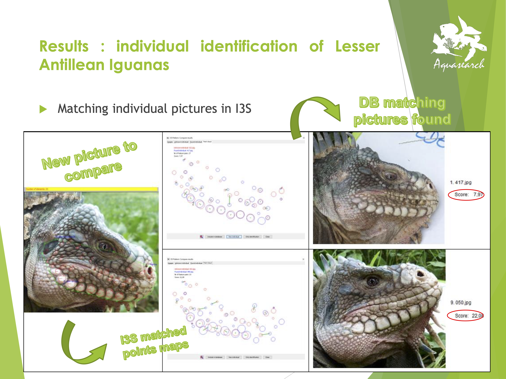
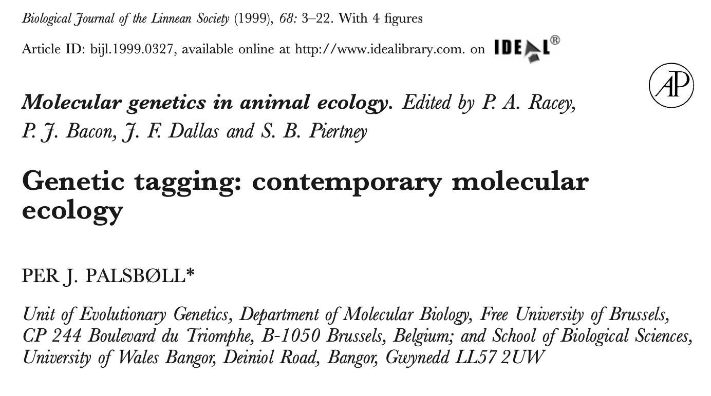
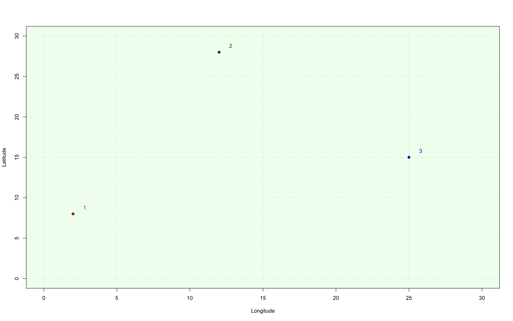
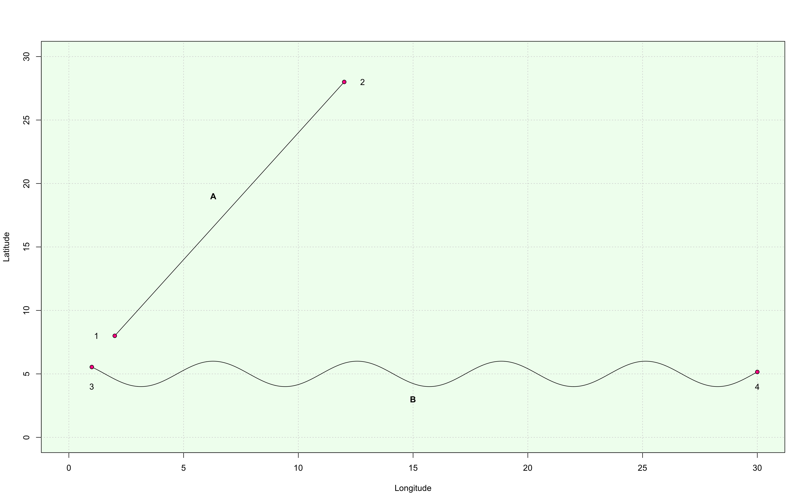
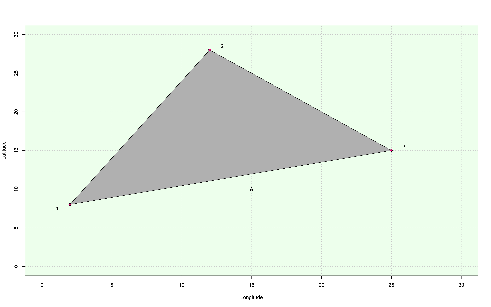

```{r setup, include=FALSE}
knitr::opts_chunk$set(echo = TRUE)
x <- c("ggplot2",
       "knitr",
       "plotrix",
       "raster", "rgdal",
       "sf", "spData", "spDataLarge")

lapply(x, require, character.only = T)
rm(x)
```

# Overview

In this first lesson we will:

- talk about the class;
- opening questionnaire;
- cover the basics of Animal Tracking;
- set up your computers;
- get you acquainted with the most commonly used spatial data objects and their features;
- get an overview of some Coordinate Reference Systems (CRSs);
- exercise assignment.

To navigate back to the course home page click [here!](https://giulianocolosimo.github.io/anmtbc_2022/)

# Questionnaire

Open your computers and navigate to: 

<center>https://forms.gle/AC7769WjLSUAM3Q58</center>

Complete the on-line questionnaire. It should not take more than 15 minutes and note that this questionnaire has no value towards your final grade in this class!

# Animal Tracking {.title}

Animal Tracking is a discipline that allows to gather information about the <span class="underline">biology, ecology, behavior and life history of animals starting from data on their position in the natural environment</span>. There are a few major requirements for this discipline to be successful:

1. the capability to uniquely identify individuals, populations or species;
2. the availability of position data for that individual (population or species) and a geographic reference system that helps minimizing errors when calculating parameters of interest (distance traveled, area covered, etc. etc.);
3. the availability of reliable environmental data!

The first requirement is fundamental. How can we say anything about a certain individual, population or species if we are not able to identify it (them)? [@Costa2015]. 

The second and third points are also very important as they allow to pinpoint the exact location of the studied organism and, through the use of statistical methods, to relate observations with environmental variables and  perform predictions about the distribution and persistence of individuals [@Guisan2000].

# Tagging systems

A tag is a label! A tagging system is a way of labeling "something" to provide that something with an unique identifier. People have been tagging animals (wild and captive) for hundreds of years. An animal tag can be as simple as a piece of metal or plastic with a number carved on it or with a standardized meaning.

```{r fig_1, echo=FALSE, fig.align='center', fig.cap='**Figure 1:** A male *Cyclura carinata* with colored bead tags. Photo credits: Giuliano Colosimo.', out.width='58%'}
knitr::include_graphics('../../figures/1_1_iguana_beads.png')
```

Plastic and/or metal tags are widely used in many domestic species of economic interest (cattle, sheep, goats, pigs) as well as wild species (from insects to mammals from reptiles to birds). The same system is also used for tagging plants of agricultural interest and for the management of forests.


# Passive Integrated Transpoder (PIT) tags

These tags are widely used for wildlife fauna, especially in long-term capture-mark-recapture studies. They uniquely identify individuals. They generally do not carry any other information but the individual's ID. They are based on the RFID (Radio-Frequency-Identification) system.  When the tag is within reach of a specific radio frequency, it emits a signal containing an alpha-numeric code unique to the animal it has been implanted. 

```{r fig_2, echo=FALSE, fig.align='center', fig.cap='**Figure 2:** A Passive Integrated Transponder by Trovan&#174;. Photo credits: Giuliano Colosimo.', out.width='58%'}
knitr::include_graphics('../../figures/1_2_pit.png')
```

This very technology is also widely used in domestic pets like cats and dogs.

# Patterns tagging

## Toes and nail clipping. 

Still accepted and practiced in wildlife herpetological studies. Not really easy to use across the board. For example, many animals lose their fingers during fights, and when that happens it is impossible to use this methodology to identify an individual. 

```{r fig_3, echo=FALSE, fig.align='center', fig.cap='**Figure 3:** This image is from a 1992 paper [@Waichman1992] in which the author describes all possible combination of toe clipping to uniquely identify individuals.', out.width='70%'}
knitr::include_graphics('../../figures/1_2_toe_clipping.png')
```

## Features tagging

In some species it is possible to use specific features to uniquely identify an individual. With an adequate sampling and HD images it is possible to build a photographic database to clearly and uniquely identify individuals.

```{r fig_4, echo=FALSE, fig.align='center', fig.cap='**Figure 4:** Toads of the genus *Bombina* have unique spotted patterns. Photo credits: [marioeffe](https://www.naturamediterraneo.com/forum/topic.asp?TOPIC_ID=273624)', out.width='70%'}
knitr::include_graphics('../../figures/1_3_morpho_pattern.png')
```

## Photo tagging

More modern approaches rely on the use of morphometric cues to identify individuals! These techniques are more complex, but somewhat similar to the FaceID technology on your phones.

```{r fig_5, echo=FALSE, fig.align='center', fig.cap='**Figure 5:** Development of a photo recognition software to identify iguanas in the wild. Image courtesy of Nathalie Duporge. A nice example and protocol of the use of photografies for the identification of unique individuals is presented in @Chehrsimin2017', out.width='70%'}

```

# Molecular tags

From the [USGS](https://www.usgs.gov/centers/fort-collins-science-center/science/molecular-tagging) website:

>Molecular tagging is a new application of molecular genetic techniques to traditional mark-recapture methodology designed to address situations where traditional methods fail. In such studies, non-invasively collected samples (such as feces, feathers, or fur) are used as a source of DNA that is then genotyped at multiple loci such that each individual animal can be uniquely identified. Thus, each individual’s DNA represents a unique tag analogous to a band or other mark used in traditional mark-recapture studies.

```{r fig_6, echo=FALSE, fig.align='center', fig.cap='**Figure 6:** The idea of molecular taggin is new, but not so new as you may think! @Palsboll1999 was already talking about molecular tagging befor the beginning of the current millennium!',  out.width='70%'}

```

The large scale application of molecular tagging techniques is definitely more recent. 

```{r fig_7, echo=FALSE, fig.align='center', fig.cap='**Figure 7:**Selected species and locations for which genetic tagging for demographic insights into population density, growth rates, direct measures of connectivity, or human–wildlife conflict has been successfully applied. Projects using genetic tagging for these demographic insights have been conducted on every continent, except Antarctica, and have sampled a variety of taxa, using many different sources of DNA, but are biased toward mid-large sized mobile mammals. [@Lamb2019]',  out.width='70%'}
knitr::include_graphics('../../figures/1_x_genetic_tagging_b.png')
```

# Radio-tracking tags

Small devices transmitting specific radio frequencies have been, and still are, widely used to track animals. 

```{r fig_8, echo=FALSE, fig.align='center', fig.cap='**Figure 8:** Barrell transmitter implanted in a female Turks and Caicos Rainbow Boa (*Chilabothrus chrysogaster*). Photo credits: Giuliano Colosimo.', out.width='70%'}
knitr::include_graphics('../../figures/1_4_boa_transmitter.png')
```

These types of tags are generally used in telemetry studies. 

Telemetry (𝛕𝛈𝛌𝛆 = far, 𝛍𝛆𝛕𝛒𝛐𝛎 = measurement) is a technique that allows to retrieve real time data and information using an array of wireless data transfer protocols.

```{r fig_9, echo=FALSE, fig.align='center', fig.cap='**Figure 9:** Radio-telemetry has been, and still is, widely used to retrieve information about the whereabouts of tagged individuals. Photo credits: Giuliano Colosimo.', out.width='70%'}
knitr::include_graphics('../../figures/1_4_reynolds_antenna.png')
```

# Satellite-tracking tags

More complex electronic devices that not only identify an individual, but also provide useful information about that animal and its environment [@Loreti2019; @Loreti2020; @Colosimo2021].

```{r fig_10, echo=FALSE, fig.align='center', fig.cap='**Figure 10:** A male *Conolophus marthae* with a Wireless Sensor Node (WSN) attached behind its hindlegs. This is a more sofisticated electronic tag that not only allows to identify the individual but also allows to collect important information such as GPS data, temperature and UV light. Photo credits: Giuliano Colosimo.', out.width='60%'}
knitr::include_graphics('../../figures/1_5_iguana_wsn.png')
```

# Analyze and visualize data

Eventually, data can be organized and analyzed to produce really informative (and cool!) animations.

```{r fig_11, echo=FALSE, fig.align='center', fig.cap='**Figure 11:** Migration patterns of cranes (*Grus grus*) from Sweden. The data was downloaded from [www.movebank.org](www.movebank.org). We will be using this website as resource throughout the course and we will be using different routines in **R** and **RStudio** to analyze and visualize the data.', out.width='70%'}
knitr::include_graphics('../../animations/1_5_cranes.gif')
```

```{r fig_12, echo=FALSE, fig.align='center', fig.cap='**Figure 12:** 3D reconstruction of Volcan Wolf, with habitat layer and the track of an individual.', out.width='70%'}
#knitr::include_graphics('../../animations/1_x_wlf_environment.gif')
```

# Setting up your computer {.title}

For the longest time data were collected by hand and/or transcribed onto an electronic sheet. In animal tracking, and more generally in every discipline involving the use of georeferenced data, computers have become increasingly important. That is why setting up your computer is fundamental if you are interested in working in this discipline and if you want to pass this class :-)

To visualize and analyse data and to produce reports on all the activities of this course we will be using **R** and **RStudio**. These are free cross-platform software. 

- Visit the **R** (https://cran.r-project.org) page and download the **R** version compatible to your OS. Install the software following the instructions.

- Visit the **RStudio** (https://www.rstudio.com/products/rstudio/download/) page and download the **RStudio** Desktop version compatible with your OS. Install the software following the instructions.

**NOTE**: **RStudio** is an Integrated Development Environment (IDE) within which it should be easier to organize your **R** workflow. <span class="underline">Learning all the specifics of **R** and **RStudio** is beyond the scope of this course and it is a student's responsibility to learn the basics of these tools. That being said, you can always write me with your questions if something does not work on your computer and I will help troubleshooting potential issues. </span>

Once software have been installed, open **RStudio**. If everything worked appropriately when you first open **RStudio**, you should see 4 different panes organized in the following way:

- *top left*: the editor where you edit scripts, documents and can run code directly in the console;
- *bottom left*: the **R** console, where the code is run. You can type code directly into the console OR you can send it to the console by running it from the editor;
- *top right*: your environment/history panes. This is where you can see variables you’ve created and a full history of functions / commands you have run;
- *bottom right*: by default contains several panes including: files/plots/packages/help/viewer. The files pane allows you to explore files on your computer like you would in windows explorer or finder on a mac. The plots tab is where you will see plots that you create.

```{r fig_13, echo=FALSE, fig.align='center', fig.cap='**Figure 13:** Screen shot of what you should see at the end of the installation of all the software. Note that colors and panes arrangement is likely going to be different on your computer. You can change many of the aspects parameters in **RStudio** and you can arrange colors and panes in the way that works best for you.', out.width='75%'}
knitr::include_graphics('../../figures/1_6_r_rstudio.png')
```

There are thousands of available libraries (aka, *packages*) that can be used to perform many different calculations. As we proceed we will be installing all the libraries we need. 

```{r fig_14, echo=FALSE, fig.align='center', fig.cap='**Figure 14:** This graph shows how the interest in spatial analysis increased in the last ten years. The package **sf** [@Pebesma2018] has received a lot of attention and it has become one of the new standard on how to use and treat certain types of spatial data.', out.width='70%'}
knitr::include_graphics('../../figures/1_7_package_downloads.png')
```

# Check your installation

A very basic check of your installation. Write the following code and you should get the exact same plot as presented here.

```{r test, echo=TRUE}
plot(cars)
```


# The basics of spatial data

A spatial phenomenon is either an object with a clear and well defined boundary (a city, a river, a plot of land) or something lacking a clear boundary (temperature, elevation, precipitations). 

The main characteristic of spatial objects, whether discrete or continuous, is that they have a set of coordinates attached to them. Having coordinates means that we have a way to index that object in space. 

We will touch on Coordinate Reference Systems (CRS) in this first lesson, but first we will focus on the most common and widely used types of spatial data.

<div class='left' style='float:left;width:48%'>
  **Vector Data**
  
This type of data usually consists of a shape specification (also referred to as *geometry*) and a set of variables and attributes telling us something about that particular shape. The simplest case of geometry is a set of coordinates X and Y to specify the location, for example, of a point. 
</div>

<div class='right' style='float:right;width:48%'>
  **Raster Data**
  
This type of data is used to describe continuous variables such as temperature. With raster there is not a simple shape specification. Rather, a grid of equal-size squares is superimposed to a certain area extent. Each square than assumes a specific value.
</div>


# Vector data and *sf*

**NOTE:** the world vector is used in **R** to also indicate a specific type of data format, and it is easy to get confused. Make sure to understand what a vector is when we talk about it in a spatial context!

We recognize three main types of vectors:

1. Points
2. Lines
3. Polygons

ESRI-Shapefiles (.shp file extension) is the most commonly used way of storing this type of data. Shapefiles are NOT the best way to store vector data information (https://www.switchfromshapefile.org). Some of the flows:

- it is a multi-file system (.shp, .prj, .dbf, .shx, .csv);
- no coordinate reference definition;
- attribute names are limited to 10 characters;
- only 255 attributes;
- limited data types.

For our purposes, we will be using shapefiles to import data. Within **R** the data will be converted in a more appropriate and manageable format.

<div class='left' style='float:left;width:48%'>
**Points**

- Generally used for single site locations

```{r fig_15, echo=FALSE, fig.align='center', fig.cap='**Figure 15:** Points with specific coordinates.', out.width='70%'}

```
</div>

<div class='right' style='float:right;width:48%'>
**Lines**

- Generally used for rivers or streets.

```{r fig_16, echo=FALSE, fig.align='center', fig.cap='**Figure 16:** Two lines with specific coordinates.', out.width='70%'}

```
</div>


<div class='left' style='float:left;width:48%'>
**Polygons**

- Generally used to specify home-ranges or areas of particular interest. 

```{r fig_17, echo=FALSE, fig.align='center', fig.cap='**Figure 17:** A polygon with specific coordinates.', out.width='70%'}

```

</div>

<div class='right' style='float:right;width:48%'>
Vector data are widely used. The table below shows all drivers available based on the installation of [GDAL](https://gdal.org/index.html) (GDAL is a translator library for raster and vector geospatial data formats).

```{r sf_drivers, echo = FALSE}
sf::st_drivers()
```
</div>

Recently, vector data have been represented using a specific class of data type known as *Simple Feature*. 

*Simple Feature* is an open standard developed and endorsed by the [Open Geospatial Consortium (OGC)](https://www.ogc.org). The official definition from their documentation is the following: *The simple feature geometry object model is Distributed Computing Platform neutral and uses UML (Unified Modeling Language) notation. The base Geometry class has subclasses for Point, Curve, Surface and GeometryCollection. Each geometric object is associated with a Spatial Reference System, which describes the coordinate space in which the geometric object is defined*.

In **R** *Simple Features* are handled by the **sf** package [@Pebesma2018]. This is the successor of the **sp** [@Pebesma2005] package based on the OGC standard Simple Features. As its successor, **sf** combines the functionality of **sp** with those of two other packages for the analysis of geospatial data: **rgeos** [@Bivand2021] and **rgdal** [@Bivand2021b]. The **sf**  package handles additional vector data types (e.g. polygon and multipolygon are two separate classes), allows for easier data processing, and supports spatial databases such as PostGIS. The official web-page for this package with various additional information is available [here](https://r-spatial.github.io/sf/).


## Istalling *sf* library

```{r installation_1, eval=FALSE, message=TRUE, include=T}
# Option 1, the easy way!
install.packages("sf")
```

If option 1 does not work...we will take a look at the official *sf* [web-page](https://r-spatial.github.io/sf/).

What does an object of class sf look like?

```{r sf_load_data_lib, eval=FALSE, message=TRUE, include=T}
install.packages(c("sp", "spData", "spDataLarge"))
library(spData)
```

```{r sf_type_1, eval=FALSE, message=TRUE, include=T}
world

Simple feature collection with 177 features and 10 fields
Geometry type: MULTIPOLYGON
Dimension:     XY
Bounding box:  xmin: -180 ymin: -89.9 xmax: 180 ymax: 83.64513
Geodetic CRS:  WGS 84
```

```{r sf_type_2, echo=FALSE, message=TRUE}
world
```

# Raster data

>A raster is a spatial (geographic) data structure that divides a region into rectangles called “cells” (or “pixels”) that can store one or more values for each of these cells. Such a data structure is also referred to as a “grid” and is often contrasted with “vector” data that is used to represent points, lines, and polygons. 

This definition is a quote from [this](https://rspatial.org/raster/RasterPackage.pdf) document.

```{r raster_1, eval=T, echo = F, include=T, fig.align='center', fig.cap = "**Figure 18:** Elevation (continuous variable) raster of Wolf Volcano, Isabela Island, Galápagos."}
load("~/Dropbox/iguanas/conolophus/wsn_data_analysis/nesting_beahavior/pink_range.RData")
Wolf_elevation <- crop(Wolf_elevation, extent(pink_range)+.15)

plot(Wolf_elevation, main = "Continuous variable \nElevation",
     xaxt = 'n', yaxt = 'n',
     xlab = "Longitude", ylab = "Latitude")
```


```{r raster_2, eval=T, echo = F, include=T, fig.align='center', fig.cap = "**Figure 19:** Land use (categorical variable) on a a patch of land (these data have been randomly generated)."}
r_categorical <-  raster(matrix(sample(1:10, 900, replace = TRUE), 30, 30))

plot(r_categorical, col = hcl.colors(10, "Set 2"), main = "Categorical variable \nLand Use",
     xaxt = 'n', yaxt = 'n',
     xlab = "Longitude", ylab = "Latitude", legend = F)
par(xpd = T)
legend("topright", 
       inset = c(-0.22, 0.12),
       legend = c("Urban", "Agriculture", "Forest", "Prot. Areas", "Devel.",
                  "Nat Park", "Desert", "Land Fill", "Unknown", "Pasture"),
       pch = 22, pt.bg = hcl.colors(10, "Set 2"),
      ncol = 1, bty = "n")
```

## Istalling *raster* library

IN **R** raster objects are handled by the *raster* package [@Hijmans2022].

```{r installation_3, eval=FALSE, message=TRUE, include=T}
install.packages("raster")
```

# Coordinate Reference Systems (CRS)

A coordinate reference system allows us to use coordinates to locate features on a map. It is a rather important component of tracking, especially when dealing with animals that move significant distances.

I will briefly talk about CRS here and then we will go over a few more details during next class.

The example below is borrowed from [here](https://www.earthdatascience.org/courses/earth-analytics/spatial-data-r/intro-to-coordinate-reference-systems/), which, by the way, is a greate resource to review some of the things we will be discussing about.

```{r mapLocations, echo=TRUE, fig.align='center', fig.cap="**Figure 20:** Boulder, Mallorca and Oslo as they appear when map and cities have same and appropriate CRS.", warning=FALSE, message=FALSE}

# load shape file
worldBound <- readOGR(dsn = "~/Documents/websites/anmtbc_2022/data/110m_physical/ne_110m_land.shp")
# check data type
class(worldBound)
# check CRS
crs(worldBound)
# convert to dataframe
worldBound_df <- fortify(worldBound)
# plot using ggplot
worldMap <- ggplot(worldBound_df, aes(long,lat, group = group)) +
  geom_polygon() +
  coord_equal() +
  labs(x = "Longitude (Degrees)",
       y = "Latitude (Degrees)",
       title = "Global Map - Geographic Coordinate System",
       subtitle = "WGS84 Datum, Units: Degrees - Latitude / Longitude")

# define locations for Boulder, CO, Mallorca, Spain and  Oslo, Norway
# store coordinates in a data.frame
loc_df <- data.frame(lon = c(-105.2519, 10.7500, 2.9833),
                     lat = c(40.0274, 59.9500, 39.6167))

# add cities
worldMap +
  geom_point(data = loc_df,
             aes(x = lon, y = lat, group = NULL), colour = "springgreen",
             size = 5)
```

Now let's see what happens if we change the CRS for the map but not for the cities.

```{r mapRobin, echo=FALSE, message=FALSE, fig.align='center', fig.cap = "**Figure 21:** Boulder, Mallorca and Oslo as they appear when map and cities have different CRS."}

# change the CRS from geographic (WGS84) to projected (robin)
worldBound_robin <- spTransform(worldBound, CRS("+proj=robin"))
# check the new CRS
crs(worldBound_robin)
# convert to dataframe
worldBound_df_robin <- fortify(worldBound_robin)
# plot using ggplot
robMap <- ggplot(worldBound_df_robin, aes(long,lat, group = group)) +
  geom_polygon() +
  labs(title = "Global Map - Projected Coordinate System",
       subtitle = "Robin, Units: Meters - ±N / ±W",
       x = "X Coordinates (meters)",
       y = "Y Coordinates (meters)") +
  coord_equal()

# add cities
robMap +
  geom_point(data = loc_df,
             aes(x = lon, y = lat, group = NULL), 
             colour = "springgreen",
             size = 5)
```


# Readings

Two papers to read for next class:

- @Nathan2008
- @Cagnacci2010

# References