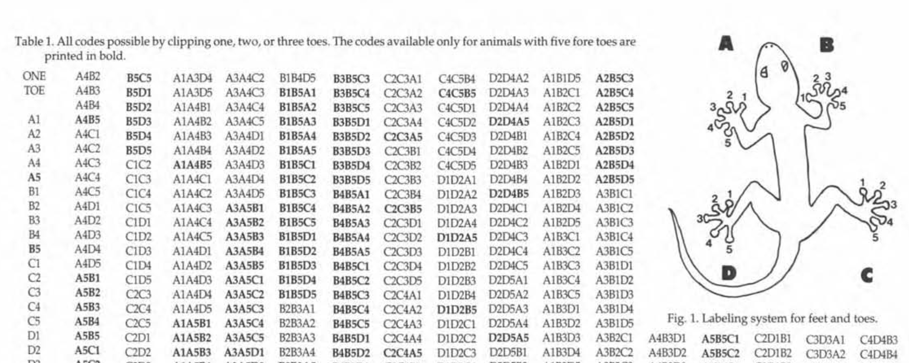
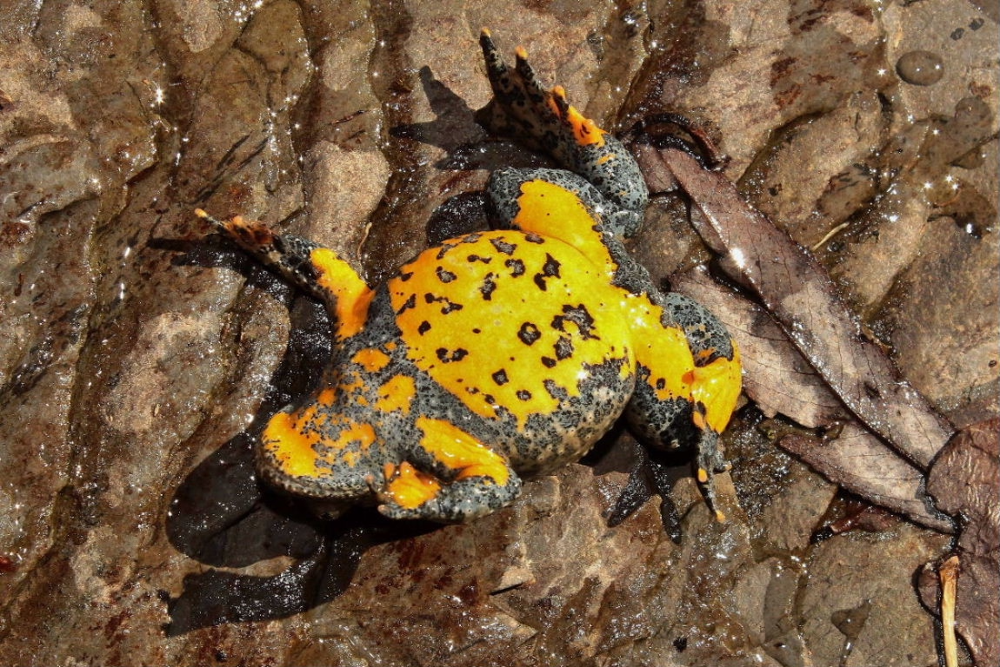
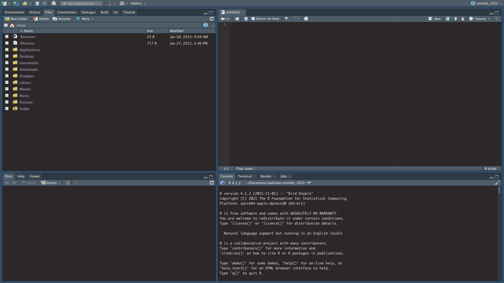
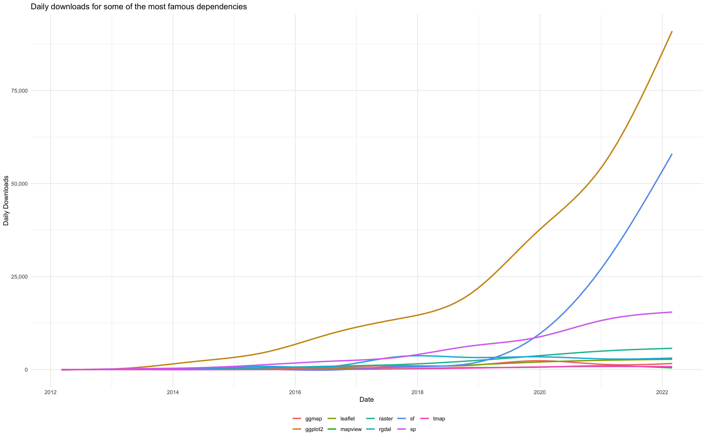

```{r setup, include=FALSE}
knitr::opts_chunk$set(echo = TRUE)
x <- c("plotrix",
       "raster",
       "sf", "spData", "spDataLarge")

lapply(x, require, character.only = T)
rm(x)
```

# Overview

In this first lesson we will:

- Questionnaire;
- cover the basics of Animal Tracking;
- set up your computers;
- get you acquainted with the most commonly used spatial data objects and their features;
- get an overview of some Coordinate Reference Systems (CRSs);
- exercise assignment.

To navigate back to the class home page click [here!](https://giulianocolosimo.github.io/anmtbc_2022/)

# Questionnaire;

Open your computers and navigate to: 

<center>https://forms.gle/AC7769WjLSUAM3Q58</center>

# Animal Tracking {.title}

Animal Tracking is a discipline that allows to gather information about the <font color="red">biology, ecology, behavior</font> and <font color="red"> life history </font> of animals starting from data on their <font color="red"> position</font> in the natural environment. There are a few major requirements for this discipline to be successful:

1. the capability to uniquely identify individuals, populations or species;
2. the availability of position data for that individual (population or species) and a geographic reference system that help minimizing errors when calculating parameters of interest (distance traveled, area covered, etc. etc.);
3. the availability of reliable environmental data!

The first requirement is fundamental. How can we say anything about a certain individual, population or species if we are not able to identify it (them)? [@Costa2015]. 

The second and third points are also very important as they allow to pinpoint the exact location of the studied organism and, through the use of statistical methods, to relate observations with environmental variables and  perform predictions about the distribution and persistence of individuals [@Guisan2000].

# Tagging systems

A tag is a label! A tagging system is a way of labeling "something" to provide that something with an unique identifier. People have been tagging animals (wild and captive) for hundreds of years. An animal tag can be as simple as a piece of metal or plastic with a number carved on it or with a standardized meaning.

```{r fig_1, echo=FALSE, fig.align='center', fig.cap='**Figure 1:** A male *Cyclura carinata* with colored bead tags. Photo credits: Giuliano Colosimo.', out.width='58%'}
knitr::include_graphics('../../figures/1_1_iguana_beads.png')
```

# Passive Integrated Transpoder (PIT) tags

These tags are widely used for wildlife and domestic fauna. They uniquely identify individuals. They generally do not carry any other information but the individual's ID. When the tag is within reach of a specific radio frequency, it emits a signal containing an alpha-numeric code unique to the animal it has been implanted. 

```{r fig_2, echo=FALSE, fig.align='center', fig.cap='**Figure 2:** A Passive Integrated Transponder by Trovan&#174;. Photo credits: Giuliano Colosimo.', out.width='58%'}
knitr::include_graphics('../../figures/1_2_pit.png')
```

# Patterns tagging

Toes and nail clipping. Still accepted and practiced, although not really easy to use across the board. For example, many animals lose their fingers during fights, and when that happens it is impossible to use this methodology to identify an individual. 

```{r fig_3, echo=FALSE, fig.align='center', fig.cap='**Figure 3:** This image is from a 1992 paper [@Waichman1992] in which the author describes all possible combination of toe clipping to uniquely identify individuals.', out.width='70%'}

```

In some species it is possible to use specific features to uniquely identify an individual.

```{r fig_3b, echo=FALSE, fig.align='center', fig.cap='**Figure 4:** Toads of the genus *Bombina* have unique spotted patterns. Photo credits: [marioeffe](https://www.naturamediterraneo.com/forum/topic.asp?TOPIC_ID=273624)', out.width='70%'}

```

# Molecular tags

From the [USGS](https://www.usgs.gov/centers/fort-collins-science-center/science/molecular-tagging) website: *Molecular tagging is a new application of molecular genetic techniques to traditional mark-recapture methodology designed to address situations where traditional methods fail. In such studies, non-invasively collected samples (such as feces, feathers, or fur) are used as a source of DNA that is then genotyped at multiple loci such that each individual animal can be uniquely identified. Thus, each individual’s DNA represents a unique tag analogous to a band or other mark used in traditional mark-recapture studies.*


# Radio-tracking tags

Small devices transmitting specific radio frequencies have been, and still are, widely used to track animals. 

```{r fig_4, echo=FALSE, fig.align='center', fig.cap='**Figure 5:** Barrell transmitter implanted in a female Turks and Caicos Rainbow Boa (*Chilabothrus chrysogaster*). Photo credits: Giuliano Colosimo.', out.width='70%'}
knitr::include_graphics('../../figures/1_4_boa_transmitter.png')
```

These types of tags are generally used in telemetry studies. 

Telemetry (𝛕𝛈𝛌𝛆 = far, 𝛍𝛆𝛕𝛒𝛐𝛎 = measurement) is a technique that allows to retrieve real time data and information using an array of wireless data transfer protocols.

```{r fig_5, echo=FALSE, fig.align='center', fig.cap='**Figure 6:** Radio-telemetry has been, and still is, widely used to retrieve information about the whereabouts of tagged individuals. Photo credits: Giuliano Colosimo.', out.width='70%'}
knitr::include_graphics('../../figures/1_4_reynolds_antenna.png')
```


# Satellite-tracking tags

More complex electronic devices that not only identify an individual, but also provide useful information about that animal and its environment.

```{r fig_6, echo=FALSE, fig.align='center', fig.cap='**Figure 2:** A male *Conolophus marthae* with a Wireless Sensor Node (WSN) attached behind its hindlegs. This is a more sofisticated electronic tag that not only allows to identify the individual but also allows to collect important information such as GPS data, temperature and UV light. Photo credits: Giuliano Colosimo.', out.width='60%'}
knitr::include_graphics('../../figures/1_5_iguana_wsn.png')
```

# Preview of animated spatial data

Eventually, data can be organized and analyzed to produce really informative (and cool) animations.

```{r fig_7, echo=FALSE, fig.align='center', fig.cap='**Figure 5:** Migration patterns of cranes (*Grus grus*) from Sweden. The data was downloaded from [www.movebank.org](www.movebank.org). We will be using this website as resource throughout the course and we will be using different routines in **R** to analyze the data.', out.width='70%'}
knitr::include_graphics('../../animations/1_5_cranes.gif')
```

# Setting up your computer {.title}

For the longest time data were collected by hand and/or transcribed onto an electronic sheet. In animal tracking, and more generally in every discipline involving the use of georeferenced data, computers have become increasingly important. That is why setting up your  fundamental if you are interested in working in this discipline and if you want to pass this class :-)

To visualize and analyse data and to produce reports on all the activities of this course we will be using **R** and **RStudio**. These are free cross-platform software. 

- Visit the **R** (https://cran.r-project.org) page and download the version of the **R** version compatible to your OS. Install the software following the instructions.

- Visit the **RStudio** (https://www.rstudio.com/products/rstudio/download/) page and download the **RStudio** Desktop version compatible with your OS. Install the software following the instructions.

**NOTE**: **RStudio** is an Integrated Development Environment (IDE) within which it should be easier to organize your **R** workflow. Learning all the specifics of **R** and **RStudio** is beyond the scope of this course and it is a student's responsibility to learn the basics of these tools. That being said, *you can always write me with your questions if something does not work on your computer* and I will help troubleshooting potential issues.

Once software have been installed, open **RStudio**. If everything worked appropriately when you first open **RStudio**, you should see 4 different panes organized in the following way:

- *top left*: the editor where you edit scripts, documents and can run code directly in the console;
- *bottom left*: the **R** console, where the code is run. You can type code directly into the console OR you can send it to the console by running it from the editor;
- *top right*: your environment/history panes. This is where you can see variables you’ve created and a full history of functions / commands you have run;
- *bottom right*: by default contains several panes including: files/plots/packages/help/viewer. The files pane allows you to explore files on your computer like you would in windows explorer or finder on a mac. The plots tab is where you will see plots that you create.

```{r fig_8, echo=FALSE, fig.align='center', fig.cap='**Figure 6:** Screen shot of what you should see at the end of the installation of all the software. Note that colors and panes arrangement is likely going to be different on your computer. You can change many of the aspects parameters in **RStudio** and you can arrange colors and panes in the way that works best for you.', out.width='75%'}

```

There are thousands of available libraries (aka, *packages*) that can be used to perform many different calculations. As we proceed we will be installing all the libraries we need. 

```{r fig_9, echo=FALSE, fig.align='center', fig.cap='**Figure 7:** This graph shows how the interest in spatial analysis increased in the last ten years. The package **sf** [@Pebesma2018] has received a lot of attention and it has become one of the new standard on how to use and treat certain types of spatial data.', out.width='70%'}

```

# The basics of spatial data

The main characteristic of a spatial object is that it has coordinates attached to it. Having coordinates means that we have a way to index that object on a map. We will touch on Coordinate Reference Systems (CRS) here, but first we will focus on the most common and widely used types of spatial data:

1. Vector Data 
2. Raster Data

# Vector data


**NOTE:** the world vector is used in **R** to also indicate a specific type of data format, and it is easy to get be confused. Make sure to understand what a vector is when we talk about it in a spatial context!

We recognize three main types of vectors:

1. Points
2. Lines
3. Polygons

## Points

- Points, generally used for single site locations (cities, field observations, buildings)

```{r points_1, echo = FALSE,  fig.align='center'}
plot(1, xlim = c(0,30), ylim = c(0,30), 
     # xaxt = 'n', yaxt = 'n',
     xlab = "Longitude", ylab = "Latitude",
     type = "n")
rect(par("usr")[1], par("usr")[3],
     par("usr")[2], par("usr")[4],
     col = "honeydew")
par(new = TRUE)
grid()
points(x = c(2, 12, 25), y = c(8, 28, 15),
       pch = 21, 
       bg = c("red", "darkgreen", "blue"))
text(x = c(2, 12, 25) + .8, y = c(8, 28, 15)+ .8, 
     labels = c(1, 2, 3),
     col = c("red", "darkgreen", "blue"))
```

```{r points_2, echo = FALSE}
(data.frame("Point_ID" = c("1", "2", "3"),
           "Type" = c("Vegetation", "Vegetation", "Vegetation"),
           "Characteristics" = c("Shrubs", "Grass", "Forest")))
```

## Lines

- Lines, generally used for rivers or streets.

```{r lines_1, echo = FALSE, fig.align='center'}
plot(1, xlim = c(0,30), ylim = c(0,30), 
     #xaxt = 'n', yaxt = 'n',
     xlab = "Longitude", ylab = "Latitude",
     type = "n")
rect(par("usr")[1], par("usr")[3],
     par("usr")[2], par("usr")[4],
     col = "honeydew")
par(new = TRUE)
grid()
lines(x = c(2, 12), y = c(8, 28))
lines(x = seq(1, 30, 0.01), y = cos(seq(1, 30, 0.01)) + 5)
points(x = c(2, 12, 1, 30), 
       y = c(8, 28, cos(1) + 5 , cos(30) + 5), 
       pch = 21, bg = "deeppink")
text(x = c(2, 12, 1, 30) + c(-.8, .8, 0, 0),
     y = c(8, 28, 4, 4) + c(0, 0, 0, 0), 
     labels = c(1, 2, 3, 4))
text(x = c(6.3, 15),
     y = c(19, 3), 
     labels = c("A", "B"), font = 2)
```

```{r lines_2, echo = FALSE}
(data.frame("Line_ID" = c("A", "B"),
           "Type" = c("Road", "River"),
           "Length" = c("15 km", "20 km"),
           "Features" = c("straight", "bends")))

```

## Polygons

- Polygons, generally used to specify home-ranges or areas of particular interest. 

```{r polygons, echo = FALSE, fig.align='center'}
plot(1, xlim = c(0,30), ylim = c(0,30), 
     #xaxt = 'n', yaxt = 'n',
     xlab = "Longitude", ylab = "Latitude",
     type = "n")
rect(par("usr")[1], par("usr")[3],
     par("usr")[2], par("usr")[4],
     col = "honeydew")
par(new = TRUE)
grid()
polygon(x = c(2, 12, 25), y = c(8, 28, 15), 
        col = "grey")
points(x = c(2, 12, 25), 
       y = c(8, 28, 15), 
       pch = 21, bg = "deeppink")
text(x = c(2, 12, 25) + c(-.9, .9, .9),
     y = c(8, 28, 15) + c(-.5, .5, .5), 
     labels = c(1, 2, 3))
text(x = 15,
     y = 10, 
     labels = "A", font = 2)
```

```{r polygons_2, echo = FALSE}
(data.frame("Polygon_ID" = "A",
           "Type" = "Forest",
           "Area" = "25 hectares",
           "Features" = "private land"))
```


Vector data are widely used. The table below shows all drivers available based on the installation of [GDAL](https://gdal.org/index.html) (GDAL is a translator library for raster and vector geospatial data formats).

```{r sf_drivers, echo = FALSE}
sf::st_drivers()
```

Recently, vector data have been represented using a specific class of data type known as *Simple Feature*. 

*Simple Feature* is an open standard developed and endorsed by the [Open Geospatial Consortium (OGC)](https://www.ogc.org). The official definition from their documentation is the following: *The simple feature geometry object model is Distributed Computing Platform neutral and uses UML (Unified Modeling Language) notation. The base Geometry class has subclasses for Point, Curve, Surface and GeometryCollection. Each geometric object is associated with a Spatial Reference System, which describes the coordinate space in which the geometric object is defined*.

In **R** *Simple Features* are handled by the **sf** package [@Pebesma2018]. This is the successor of the **sp** [@Pebesma2005] package based on the OGC standard Simple Features. As its successor, **sf** combines the functionality of **sp** with those of two other packages for the analysis of geospatial data: **rgeos** [@Bivand2021] and **rgdal** [@Bivand2021b]. The **sf**  package handles additional vector data types (e.g. polygon and multipolygon are two separate classes), allows for easier data processing, and supports spatial databases such as PostGIS. The official web-page for this package with various additional information is available [here](https://r-spatial.github.io/sf/).

What does an object of class sf look like?

```{r sf_load_data_lib, eval=FALSE, message=TRUE, include=T}
library(spData)
```

```{r sf_type_1, eval=FALSE, message=TRUE, include=T}
world

Simple feature collection with 177 features and 10 fields
Geometry type: MULTIPOLYGON
Dimension:     XY
Bounding box:  xmin: -180 ymin: -89.9 xmax: 180 ymax: 83.64513
Geodetic CRS:  WGS 84
```

```{r sf_type_2, echo=FALSE, message=TRUE}
world
```

# Raster data

A different type of spatial data is called raster. Raster data differ from vector data as they are not associated to sets of latitudinal and longitudinal values, but they rather encompass a geographic area and divide that area in cells of user-defined size (i.e, a raster's resolution). To each cell is then assigned a valued dependent on the characteristic of interest. Raster can be used to represent continuous and/or categorical variables.

```{r raster_1, eval=T, echo = F, include=T, fig.align='center', fig.cap = "**Figure 11:** Elevation (continuous variable) raster of Wolf Volcano, Isabela Island, Galápagos."}
load("~/Dropbox/iguanas/conolophus/wsn_data_analysis/nesting_beahavior/pink_range.RData")
Wolf_elevation <- crop(Wolf_elevation, extent(pink_range)+.15)

plot(Wolf_elevation, main = "Continuous variable \nElevation",
     xaxt = 'n', yaxt = 'n',
     xlab = "Longitude", ylab = "Latitude")
```


```{r raster_2, eval=T, echo = F, include=T, fig.align='center', fig.cap = "**Figure 12:** Land use (categorical variable) on a a patch of land (these data have been randomly generated)."}
r_categorical <-  raster(matrix(sample(1:10, 900, replace = TRUE), 30, 30))

plot(r_categorical, col = hcl.colors(10, "Set 2"), main = "Categorical variable \nLand Use",
     xaxt = 'n', yaxt = 'n',
     xlab = "Longitude", ylab = "Latitude", legend = F)
par(xpd = T)
legend("topright", 
       inset = c(-0.22, 0.12),
       legend = c("Urban", "Agriculture", "Forest", "Prot. Areas", "Devel.",
                  "Nat Park", "Desert", "Land Fill", "Unknown", "Pasture"),
       pch = 22, pt.bg = hcl.colors(10, "Set 2"),
      ncol = 1, bty = "n")
```


# Coordinate Reference Systems (CRS)

# Excercises

The first paper to read for the next time we meet (i.e., 2022-04-15) was written by Cagnacci and colleagues in 2010 [@Cagnacci2010]. 


# References