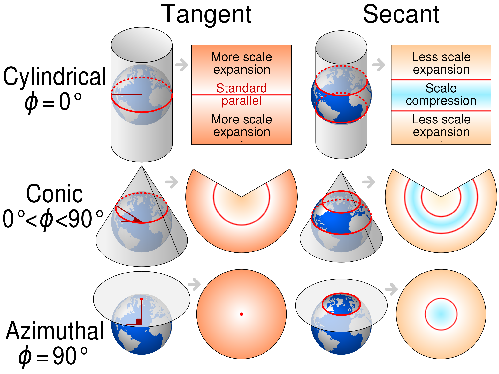

```{r setup, include=FALSE}
knitr::opts_chunk$set(echo = TRUE)
x <- c("plotrix",
       "raster",
       "sf", "spData", "spDataLarge")

lapply(x, require, character.only = T)
rm(x)
```

# Recap

Previously we:

- covered the basics of Animal Tracking;
- introduced vector and raster data;
- got a brief overview of some Coordinate Reference Systems (CRSs);

To navigate back to the course home page click [here!](https://giulianocolosimo.github.io/anmtbc_2022/)

# Overview

In this second lesson we will:

- paper review and discussion;
- talk about CRSs;
- review telemetry e GPS;
- make maps in R;
- access tracking data on-line;
- paper assignment. 

<hr>

## A movement ecology paradigm for unifying organismal movement research [@Nathan2008]

>...Movement research is both plentiful and insightful, and recent methodological advances facilitate obtaining a detailed view of individual movement. Yet, we lack a general unifying paradigm. [...] The proposed framework integrates eclectic research on movement into a structured paradigm and aims at providing a basis for hypothesis generation and a vehicle facilitating the understanding of the causes, mechanisms, and spatiotemporal patterns of movement and their role in various ecological and evolutionary processes.

- External factors (R)
- Internal state (W, Why move?) 
- Navigation capacity (Φ, Where to move?)
- Motion capacity (Ω, How to move?)
- Motion path (U)

> ...augment the collection of sequential position with complementary data on the physiological [...] and behavioral [...] state of the focal individual, and on potentially influential external factors.

> An important limitation of the proposed approach is related to practical difficulties in quantifying the movement of individuals and especially in understanding the mechanisms underlying these movements. Addressing this limitation requires further technological and methodological advances [...]

<hr>

## Animal ecology meets GPS-based radiotelemetry: a perfect storm of opportunities and challenges [@Cagnacci2010]

> Direct human observations cannot provide thorough and standard data that will allow falsification of ecological hypotheses for all animals and all kinds of research questions. The most logical step is moving the point of observation from the observer to the observed (i.e. the studied animal).

> Animal positions provide the elemental unit of movement paths and show where individuals interact with the ecosystems around them.

> Clearly, the choice of a technical tool for a specific study requires critical evaluation in light of the goals and scope of the study.

> Large datasets, made available by advanced technol- ogy, present serious problems of data management, as underlined for microarrays from genomic techniques [...], physiological and behavioural data from sensors [...], animal-borne video imagery [...], and high-resolution spatio-temporal movement data [...]. Challenges include preservation of data integrity and consistency, avoidance of data redundancy, automation of data download, filtering and storage, management of specific data types, and definition of standards for objects and formats [...].

> Datasets of GPS-based locations are, essentially, time series of spatial data, usually collected with high-frequency, systematic schedules. This fact has two important consequences. First, position time series represent movement paths [...], and the higher the frequency of positions, the more trustworthy the movement paths. Trustworthiness also depends on the physiological and behavioural characteristics of the animals that affect step length [...]. Second, position time series are highly corre- lated datasets, both in time and space [...]; the higher the frequency of positions, the stronger the correlation (or autocorrelation, i.e. correlation that changes as a function of temporal or spatial distance between observations; [...]).

# Coordinate Reference Systems (CRS)

A coordinate reference system allows us to use coordinates to locate features on a map. It is a rather important component of tracking, especially when dealing with animals that move significant distances.

One of the main issue is that ultimately what we try to do is to represent locations measured on a 3D surface (the earth) to a 2D map. This introduces distortions and errors. We can visualize the problem [here!](http://icgem.gfz-potsdam.de/vis3d/longtime)

<hr>

We recognize two big classes of coordinate systems:

**Geographic coordinate**
```{r fig_1, echo=FALSE, fig.align='center', fig.cap='**Figure 1** Angles (degrees; longitude and latitude), pointing out locations on a spherical or ellipsoidal surface. [Image source](https://en.wikipedia.org/wiki/Geographic_coordinate_system)', out.width='50%'}
knitr::include_graphics('../../figures/2_1_geographic.png')
```
The earth is represented by a spherical or ellipsoidal surface. The geometric representation of the earth that is used (reference-frame) is called *datum*. The measurement of distances between points cannot be carried out with geographical coordinates.

<hr>

**Projected coordinates**
```{r fig_2, echo=FALSE, fig.align='center', fig.cap='**Figure 2** Measured on a two-dimensional flat space (e.g. in meters; x and y), related to an ellipsoid by projection. [Image source](https://en.wikipedia.org/wiki/Map_projection)', out.width='70%'}

```
In the transition from geometric coordinates to projected ones, a deformation of the images occurs. There is no system of projections that is not affected by errors and distortions.

<hr>

A couple of useful links: 

- https://spatialreference.org/ref/epsg/
- https://epsg.io


# Telemetry e GPS

## Telemetry

The term telemetry (𝛕𝛈𝛌𝛆 = far, 𝛍𝛆𝛕𝛒𝛐𝛎 = measurement) refers to an ensemble of techniques that allow to retrieve real time data and information using an array of wireless data transfer protocols.

## Global Positioning System (GPS)

- NAVSTAR = NAVigation System with Timing And Ranging
- n ≥ 4 satellites
- m ≥ 1 receivers
- Pseudo-ranges

```{r fig_3, echo=FALSE, fig.align='center', fig.cap='**Figure 3** Satellite constellation serving the GPS system. [Image source](https://en.wikipedia.org/wiki/File:ConstellationGPS.gif)', out.width='50%'}
knitr::include_graphics('../../animations/2_4_constellationGPS.gif')
```

<hr>

### How does positioning with range works?

```{r positioning_1, echo=FALSE, fig.align='center', fig.cap = '**Figure 4:** We are at a point of interest, at an undisclosed location and we want to know where exactly this point of interest is!'}
plot(x = 1:20, y = 1:20, xlim = c(1, 20), ylim = c(1, 20), type = "n", asp = 1,
     xlab = "", ylab = "", main = "Positioning with ranges",
     xaxt = 'n', yaxt = 'n')
points(x = 5 + 2, y = 7, pch = 21, bg = "red", cex = 2)
legend("topleft", legend = c("Point of interest (unknown)"),
       pch = 21, pt.bg = "red", pt.cex = 2)
```

```{r positioning_2, echo=FALSE, fig.align='center', fig.cap = '**Figure 5:** We can contact a nearby reference station.'}
plot(x = 1:20, y = 1:20, xlim = c(1, 20), ylim = c(1, 20), type = "n", asp = 1,
     xlab = "", ylab = "", main = "Positioning with ranges",
     xaxt = 'n', yaxt = 'n')
points(x = 5 + 2, y = 7, pch = 21, bg = "red", cex = 2)
points(x = 5, y = 7, pch = 21, bg = "blue", cex = 1.5)
legend("topleft", legend = c("Point of interest (unknown)",
                             "Reference point (known)"),
       pch = c(21, 21), pt.bg = c("red", "blue"),
       pt.cex = c(2, 1.5))
```

```{r positioning_3, echo=FALSE, fig.align='center', fig.cap = '**Figure 6:** Based on the strenght of the communication and on the time it takes to receive the message the reference station tells us that we are located at a certain distance from them. This is useful, but not quite enough to know exactly where we are.'}
plot(x = 1:20, y = 1:20, xlim = c(1, 20), ylim = c(1, 20), type = "n", asp = 1,
     xlab = "", ylab = "", main = "Positioning with ranges",
     xaxt = 'n', yaxt = 'n')
points(x = 5 + 2, y = 7, pch = 21, bg = "red", cex = 2)
points(x = 5, y = 7, pch = 21, bg = "blue", cex = 1.5)
segments(x0 = 5, y0 = 7, x1 = 5 + 2, y1 = 7)
draw.circle(x = 5, y = 7, radius = 2, border = "black", lty = 2)
legend("topleft", legend = c("Point of interest (unknown)",
                             "Reference point (known)",
                             "Distance"),
       pch = c(21, 21, NA), lty = c(NA, NA, 1), pt.bg = c("red", "blue"),
       pt.cex = c(2, 1.5))
```

```{r positioning_4, echo=FALSE, fig.align='center', fig.cap = '**Figure 7:** We can ask the same type of information to another reference station. The situation improves drammatically, but it is still not enough to give us the precise location.'}
plot(x = 1:20, y = 1:20, xlim = c(1, 20), ylim = c(1, 20), type = "n", asp = 1,
     xlab = "", ylab = "", main = "Positioning with ranges",
     xaxt = 'n', yaxt = 'n')
points(x = 5 + 2, y = 7, pch = 21, bg = "red", cex = 2)
points(x = 5, y = 7, pch = 21, bg = "blue", cex = 1.5)
segments(x0 = 5, y0 = 7, x1 = 5 + 2, y1 = 7)
draw.circle(x = 5, y = 7, radius = 2, border = "black", lty = 2)
points(x = 8,  y = 12, pch = 21, bg = "blue", cex = 1.5)
segments(x0 = 5 + 2, y0 = 7, x1 = 8,  y1 = 12)
AB <- sqrt((8 - (5 + 2))^2 + (12 - 7)^2)
draw.circle(x = 8, y = 12, radius = AB, border = "black", lty = 2)
legend("topleft", legend = c("Point of interest (unknown)",
                             "Reference point (known)",
                             "Distance"),
       pch = c(21, 21, NA), lty = c(NA, NA, 1), pt.bg = c("red", "blue"),
       pt.cex = c(2, 1.5))
```

```{r positioning_5, echo=FALSE, fig.align='center', fig.cap = '**Figure 8:** If we add a third reference point we can infer the geographic location of our point of interest with a very high accuracy.'}
plot(x = 1:20, y = 1:20, xlim = c(1, 20), ylim = c(1, 20), type = "n", asp = 1,
     xlab = "", ylab = "", main = "Positioning with ranges",
     xaxt = 'n', yaxt = 'n')
points(x = 5 + 2, y = 7, pch = 21, bg = "red", cex = 2)
points(x = 5, y = 7, pch = 21, bg = "blue", cex = 1.5)
segments(x0 = 5, y0 = 7, x1 = 5 + 2, y1 = 7)
draw.circle(x = 5, y = 7, radius = 2, border = "black", lty = 2)
points(x = 8,  y = 12, pch = 21, bg = "blue", cex = 1.5)
segments(x0 = 5 + 2, y0 = 7, x1 = 8,  y1 = 12)
AB <- sqrt((8 - (5 + 2))^2 + (12 - 7)^2)
draw.circle(x = 8, y = 12, radius = AB, border = "black", lty = 2)
points(x = 17,  y = 5, pch = 21, bg = "blue", cex = 1.5)
segments(x0 = 5 + 2, y0 = 7, x1 = 17,  y1 = 5)
AC <- sqrt((17 - (5 + 2))^2 + (5 - 7)^2)
draw.circle(x = 17, y = 5, radius = AC, border = "black", lty = 2)
legend("topleft", legend = c("Point of interest (unknown)",
                             "Reference point (known)",
                             "Distance"),
       pch = c(21, 21, NA), lty = c(NA, NA, 1), pt.bg = c("red", "blue"),
       pt.cex = c(2, 1.5))
```

As you know, distance is a function of time and speed. We can assume with a certain degree of confidence that the speed of our radio signal is fairly constant ($3*10^5$Km/s). If our estimate of time is error-prone, the associated estimate of distance may also be affected by errors. That is why the distance is actually called pseudo-distance.

To minimize this error a forth reference point (satellite) is necessary!

The GPS receiver knows the position of the satellite because it is the satellite itself that sends it by communicating its orbit in a navigation message (ephemeris).

# Making maps in R

```{r echo=TRUE}
library(spData)
library(spDataLarge)
library(sf)

world

class(world)

st_crs(world)
```

Install the package *tidyr* [@Wickham2022]

```{r echo=TRUE, fig.align = 'center', fig.cap = '**Figure 9:** World representation using the WGS84 datum'}
library(tidyr)

world %>% 
  st_geometry() %>% 
  plot(main = "WGS84")
```

Lets change the CRS and see what happens when we plot.

```{r echo=TRUE, fig.align='center', fig.cap = '**Figure 10:** World representation after transforming the CRS to Lambert azimuthal equal-area'}
world %>%
  st_transform("+proj=laea +x_0=0 +y_0=0 +lon_0=0 +lat_0=0") %>% 
  st_geometry() %>% 
  plot(main = "Lambert azimuthal equal-area.")
```

Lets change one more time.

```{r echo=TRUE, fig.align='center', fig.cap = '**Figure 11:** World representation after transforming the CRS to Azimuthal equi-distant'}
world %>%
  st_transform("+proj=aeqd +x_0=0 +y_0=0 +lon_0=0 +lat_0=0") %>% 
  st_geometry() %>% 
  plot(main = "Azimuthal equi-distant")
```

And one more.

```{r echo=TRUE, fig.align='center', fig.cap = '**Figure 12:** World representation after transforming the CRS to Equal area cylindrical'}
world %>%
  st_transform("+proj=cea +zone=15 +datum=WGS84 +units=m +no_defs") %>% 
  st_geometry() %>% 
  plot(main = "Equal area cylindrical")
```

And one final time!

```{r echo=TRUE, fig.align='center', fig.cap = '**Figure 13:** World representation after transforming the CRS to Pseudo-Mercator'}
world %>%
  st_transform("+proj=merc +a=6378137 +b=6378137 +lat_ts=0.0 +lon_0=0.0 +x_0=0.0 +y_0=0 +k=1.0 +units=m +nadgrids=@null +wktext  +no_defs") %>% 
  st_geometry() %>% 
  plot(main = "Pseudo-Mercator")

```

# Databases - Movebank

High resolution data can take up a significant amount of space! That is why it is important to learn how to organize data. The better job we do to organize the data, the simpler it will be to query our database and to extract the information we need to answer our questions and test our hypotheses. 

[Movebank](https://www.movebank.org/cms/movebank-main) is...

> ...an online platform that helps researchers and wildlife managers worldwide manage, share, analyze and archive animal movement data. Movebank is hosted by the Max Planck Institute of Animal Behavior in coordination with the North Carolina Museum of Natural Sciences, the Ohio State University and the University of Konstanz. 

We will be using this resource in the next few lessons. Your first task is described in the following steps:

- connect to https://www.movebank.org/cms/movebank-main;
- create a free account (save your user name and password in a safe place);
- open **RStudio**;
- install the following packages:
   - *move* [@Kranstauber2020]
   - *ggmap* [@Kahle2013]
   - *mapview* [@Appelhans2021]

Once all of the packages have been successfully installed, we can start with a quick class exercise.

```{r exer_1, include=FALSE}
library(move)
login <- movebankLogin(username = "Giuliano", password = "2@imlL85_G")
```

```{r exer_2, echo=TRUE, fig.align = 'center', fig.cap = '**Figure 14:** Basic plot of the dataset downloaded from movebank.'}
library(move)
#login <- movebankLogin(username = "Giuliano", password = "XXXXXXXXXX")
duck <- getMovebankData(study = "Shelduck Italy ISPRA MPIAB", login = login)

duck

slotNames(duck)

table(duck@trackId)

duck@bbox 

plot(duck)
```

```{r exer_3,  echo=TRUE, fig.align = 'center', fig.cap = '**Figure 15:** A prettier image, but still not very informative for us.', message=FALSE}
library(ggmap)

basemap <- get_map(location = duck@bbox, maptype = "terrain")

duck_df <- as.data.frame(duck)

duck_df$ID <- as.factor(duck_df$deployment_id)

ggmap(basemap) + 
  geom_path(data = duck_df, mapping = aes(x = location_long, y = location_lat, col = ID), alpha = 0.5) + 
  geom_point(data = duck_df, mapping = aes(x = location_long, y = location_lat, col = ID), alpha = 0.5, size=0.5) + 
  coord_map() + scale_colour_hue(l = 40) + 
  labs(x = "Longitude", y = "Latitude") + ggtitle("Ducks locations")
```

```{r exer_4, echo=TRUE}
library(mapview)
library(sp)

duck_sp <- duck_df

coordinates(duck_sp) <- ~location_long + location_lat

proj4string(duck_sp) <- CRS("+proj=longlat +ellps=WGS84 +datum=WGS84 +no_defs")

mapview(duck_sp, legend = TRUE, zcol = "tag_id", cex = 2, lwd = 0.1, map.types = "Esri.WorldImagery")
```

# Readings

Two papers to read for next class:

- @Dodge2013
- @Kays2022 (if the link from the reference page to download this paper is not for free try [this one](https://www.movebank.org/cms/downloads/Kays_etal_2021_MEE_Movebank.pdf))

# References