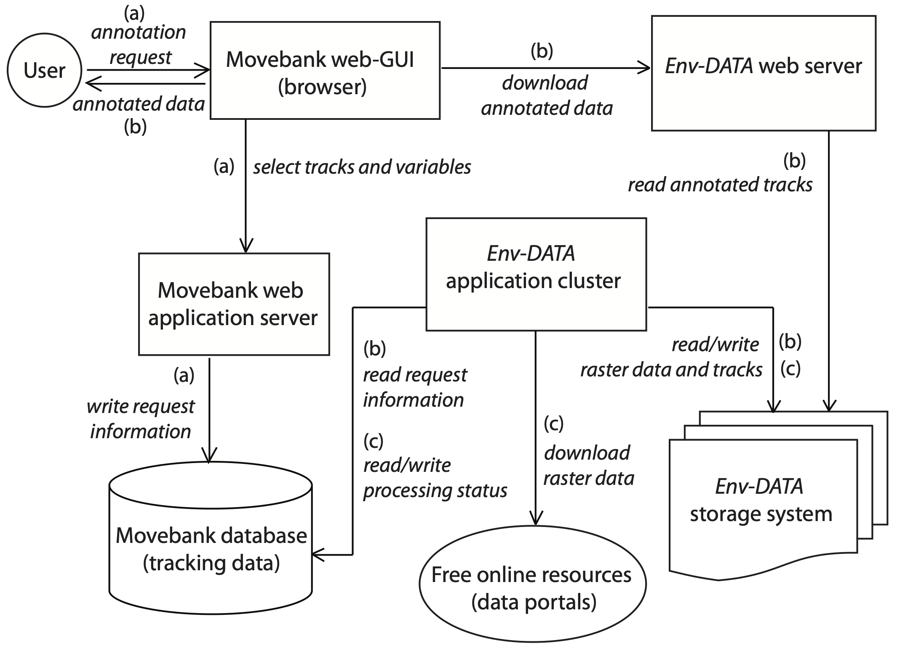
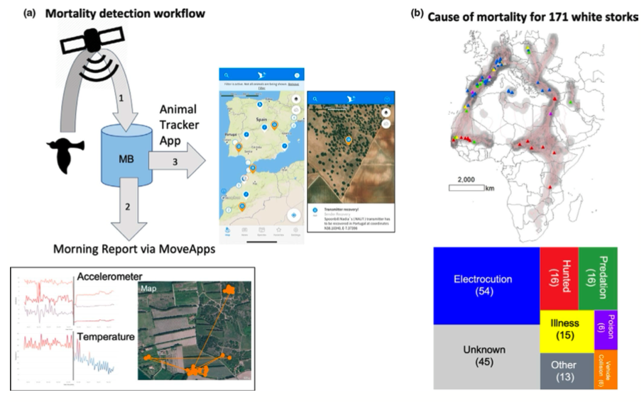

```{r setup, include=FALSE}
knitr::opts_chunk$set(echo = TRUE)
x <- c("adehabitatHR", "gplots", "ggmap", 
       "move", "moveVis",
       "plyr",
       "raster", "rgdal",
       "scales", "sf", "sp")
lapply(x, require, character.only = T)
rm(x)
```

# Recap

Previously we:

- talked about CRSs;
- reviewed telemetry e GPS;
- made maps in R;
- accessed tracking data on-line.

To navigate back to the course home page click [here!](https://giulianocolosimo.github.io/anmtbc_2022/)

# Overview

In this third lesson we will:

- access tracking data on-line;
- home range;
- exercise on estimating home range,
- paper assignment.

<hr>

## The environmental-data automated track annotation (Env-DATA) system: linking animal tracks with environmental data [@Dodge2013]

```{r fig_1, echo=FALSE, fig.align='center', fig.cap='**Figure 1** Env-DATA Track Annotation Service Components. The figure illustrates the workflow of an annotation request through the different servers and components of the system. Steps shown indicate the following: (a) selection and submission of a data annotation request by the User, (b) read annotation request information, process Track Annotation in the Env-DATA application cluster, storage of annotation results in the Env-DATA storage system, and delivery of results to User through the Env-DATA web server, and (c) environmental data acquisition and storage in the Env-DATA storage system through the Env-DATA application cluster. RZG: Computing Center Garching, Germany; OSU: The Ohio State University Supercomputer Center. [Image source](https://movementecologyjournal.biomedcentral.com/articles/10.1186/2051-3933-1-3#Sec1) from @Dodge2013', out.width='70%'}

```

```{r exer_1, include=FALSE}
login <- movebankLogin(username = "Giuliano", password = "2@imlL85_G")
```

As specified in the paper, the data is publicly available and hosted on Movebank. We can try to download them and make a basic plot of the data.

```{r exer_2, echo=TRUE, fig.align = 'center', fig.cap = '**Figure 2:** Basic plot of the Galàpagos dataset downloaded from movebank.'}
#library(move)
#login <- movebankLogin(username = "Giuliano", password = "XXXXXXXXXX")
gala_alba <- getMovebankData(study = "Galapagos Albatrosses", login = login)
plot(gala_alba)
```

### Exercise for next class

Use the function published by the authors to produce **Figure 5a** from the paper.

```{r eval=FALSE, include=T}
#  “move”: represents a set of animal locations as a SpatialPointDataFrame 
#          (“move” contains coordinates—longitude and latitude—timestamps, and other 
#          attributes such as annotated variables obtained from Env-DATA)
#	 “variable”: environmental variable name existing as a column in move. (e.g. oceanNPP)
#	 “lonlim”: a vector of min and max longitudes (e.g. lonlim = c(-95,-75)) 
#	 “latlim”: a vector of min and max latitudes (e.g. latlim = c(-14,10) )


dodge_function <- function(move, variable, latlim, lonlim) {
  require(maptools)
  require(sp)
  require(fields)
  vCol<- which(colnames(move@data)==variable)
  temp<- levels(as.factor(as.character(unique(move@data[,vCol]))))  
  temp<-as.character(temp[!is.na(temp)])
  zr=range (as.numeric(temp))
  # generate a color scale
  colorpalette <- colorRampPalette(c("blue3","cyan3","aquamarine3","yellow","orange","red")) 
  mycol=colorpalette(length(temp))
  # plot underlying map
  data(wrld_simpl)
  plot(wrld_simpl, ylim=latlim, xlim=lonlim, col="lightgray", border="gray", axes=F)
  # plot the track as a gray ployline
  points(coordinates(move), type="l", col="gray") 
  # plot track points colored using a color scale based on the variable values (high values in Red, low values in Blue)
  for(i in 1:length(temp))
  {
    plot (move[move@data[,vCol]==temp[i],],
          pch=20,add=TRUE, col=mycol[i], border="gray", axes=F)
  }
  # plot color scale legend 
  image.plot( legend.only=TRUE, zlim= zr, col=mycol,  horizontal=F, legend.width = 1, legend.mar = NULL, legend.shrink=0.8, cex.axis=0.7)
}
```

You will have to access the Env-DATA from the study and use that as input file for the function to produce the data.

## The Movebank system for studying global animal movement and demography [@Kays2022]

```{r fig_3, echo=FALSE, fig.align='center', fig.cap='**Figure 3** (a) Using Movebank to study animal mortality at a global scale is enabled by a workflow consisting of (1) near real-time automated data transfer through wireless networks to the Movebank database where (2) an automated daily ‘Morning Report’ through the MoveApps platform that alerts researchers to the possible death of an animal through sensor streams (examples from a Eurasian blackbird Turdus merula with vertical black line indicating time of death). This location is then accessible to staff, collaborators or citizen scientists through the (3) Animal Tracker app so they can conduct a forensic investigation at the site. (b) Results of this approach for 171 storks tracked across Europe and Africa. Shading on the map shows density of tracking locations, pink lines show individual bird tracks and coloured triangles show the location and cause of mortality events. Image from @Kays2022', out.width='70%'}

```

# Home range

When we talk about home range we often comprise two distinct concepts:

- an area used by an individual during its life span [@Burt1943];
- a seasonal home range, i.e. an home range that is time constrained [@Viana2018].

Home ranges, irrespective of the definition we decide to use, are instrumental to understand population dynamics and habitat use. This information can be used to inform protected area size or policy processes, advocating for specific land-tenure systems, and recovery planning for threatened species [@Crane2021].

## How is home range calculated?

The most commonly used method to estimate species or home range is the **Minimum Convex Polygon-MCP**, [@Hayne1949]. It is a standardized method, recommended by the IUCN, which defines species distribution range as the smallest polygon in which no internal angle exceeds 180 degrees and which contains all the observed sites of occurrence of the species [@IUCN2012]. This technique is widely used because it is easily-applicable and it works well when presence-only data are available [@Burgman2003]. However, the areas estimated with this method are often biased, being highly affected by the sampling regime and effort and by the presence of single isolated locations [@Burgman2003; @Borger2006].

**Kernel Density Estimators** [@Worton1989] represent a different set of methodologies to analyze the distribution of a species. The method, applied to presence-only data, estimates the probability density function of finding individuals in a portion of space. They introduce the concept of *utilization distribution*. These methods are statistically efficient, although they can be computationally time-consuming [@Bjornlie2014]. Moreover, they should be considered carefully when data are autocorrelated [@Fleming2015].

**Dynamic Brownian Bridge Movements** are a suite of models specifically designed to investigate high-resolution GPS based data-set and to elicit differences in behavioral patterns between individuals [@Kranstauber2012; @Horne2007; @Bullard1999]. The algorithm creates a single behavioral measure, the brownian-motion-variance [@Horne2007], that can be used to elucidate animal's behavior. The advantage of this approach is that it is not only based on the points coordinates on a surface area, but it also utilizes the inferred path and time between sampling locations to build a predicted utilization area [@Silva2020]. Because of this reasons, this approach is more efficiently used in behavioral analyses rather than calculation of species distribution and home-ranges. Despite this, @Silva2020 showed that this approach is to be preferred over more classical approaches such as MCPs and KDE when calculating home ranges.

<hr>

We will now download some data to calculate home ranges using different approaches.

This first link will let you download some location data

<center>https://www.dropbox.com/t/q6GjLrXe0LhDA4BD</center>

This second link will let you download the Stelvio National Park shapefile

<center>https://www.dropbox.com/t/DtGfDzXZ29PrZxoW</center>

This third link will let you download some annotated data, elevation in particular, from a region that encompasses the Stelvio National Park. The annotated data come from the Env-DATA service.

<center>https://www.dropbox.com/t/SsG6gsP3X1wZfsPt</center>

We will be using a number of different packages. <make sure that you have them installed on your computer before we proceed. A useful trick to upload multiple packages using one simple command is:

```{r load_packs, eval=FALSE, include=T}
x <- c("adehabitatHR", "gplots", "ggmap", 
       "move", "moveVis",
       "plyr",
       "raster", "rgdal",
       "scales", "sf", "sp")
lapply(x, require, character.only = T)
rm(x)
```

# The data

## Geographic background

The Stelvio National park shapefile was downloaded from [here.](https://www.protectedplanet.net/en)

```{r stelvio_shape, echo = TRUE, message = FALSE, warning = FALSE, fig.align = 'center', fig.cap = "**Figure 4:** Shapefile for Stelvio's National Park. Data accessed and downloaded from https://www.protectedplanet.net/en"}
stelvio   <- readOGR("../../data/stelvio/WDPA_WDOECM_Apr2022_Public_717_shp-polygons.shp")
class(stelvio)
crs(stelvio)
plot(stelvio, main = "Stelvio National Park", axes = TRUE, col = "green")
```

The object *stelvio* is a SpatialPolygonDataFrame (not a Simple Feature!). Still, it is an georeferenced object and we can use it to make some more detailed plots and maps. For example, we can look at the specific coordinates of the polygon and use them to download a terrain map of the National Park.

```{r stelvio_shape2, echo = TRUE, message = FALSE, warning = FALSE, fig.align = 'center', fig.cap = "**Figure 5:** A terrain map encompassing the Stelvio's National park."}
stelvio_ll <- stelvio@polygons[[1]]@Polygons[[1]]@coords
mymap <- get_map(bbox(stelvio), maptype= "terrain", zoom = 12)
ggmap(mymap) + geom_polygon(data = data.frame(stelvio_ll), aes(x = X1, y = X2), fill = alpha("pink", .2), col = "darkred")
```

The map is definitely pretty, but having the data in this format is not very useful when it comes to analyses. We can use the raster elevation data for plots.

```{r raster_elevation, echo = TRUE, message = FALSE, warning = FALSE, fig.align = 'center', fig.cap = "**Figure 6:** A raster with elevation values for an area encompassing the Stelvio's National Park"}
elevation <- raster("../../data/study_1492140027-7041621987177690948/study_1492140027-7041621987177690948/ASTER ASTGTM2 Elevation/ASTER ASTGTM2 Elevation-20220412000000000-0-0.tif")
plot(elevation, col = terrain.colors(10))
lines(stelvio, col = "blue", lwd = 2)
```

**WHAT DID WE DO WRONG?**

We did not double check the conformity between the CRS in *stelvio* and in *elevation*!

```{r check_crs, echo = TRUE, message = FALSE, warning = FALSE}
identicalCRS(stelvio, elevation)
```

Now that we know they both have the same CRS we can proceed with the plot an we can even crop the raster file so that it is more centered on the Stelvio's National park area.

```{r raster_elevation2, echo = TRUE, message = FALSE, warning = FALSE, fig.align = 'center', fig.cap = "**Figure 7:** Cropped image of the Stelvio's National Park and the elevation raster"}
elevation <- crop(elevation, extent(stelvio) + 0.2)
plot(elevation, col = terrain.colors(10))
lines(stelvio, col = "blue", lwd = 2)
```

## Tracking data

Lets take a look at the actual tracking data! 

```{r echo = TRUE, message = FALSE, warning = FALSE} 
fox_data <- read.csv("../../data/fox_data.csv", header = T)
head(fox_data)
crs(fox_data)
```

As you can see from the message at your prompt, there is no CRS associated with the fox dataset. This is normal as we loaded the data from a regular .csv (comma separated values) file. 

This set of GPS data was created *ad-hoc* for this exercise. The data point were generated using a coordinate reference system based on longitude and latitude and on a WGS84 datum. Therefore, we can simply plot the points on a map and see how they look like.   

```{r echo = TRUE, message = FALSE, warning = FALSE, fig.align = 'center', fig.cap = "**Figure 8:** Plot of the GPS data recorded for two foxes in the proximity of the Stelvio National Park"}
plot(elevation, col = terrain.colors(10))
lines(stelvio, col = "blue", lwd = 2)
points(fox_data$lon, fox_data$lat, pch =21, bg = ifelse(fox_data$id == "Fox_01", "red", "purple"))
```

We can also take a look at some additional information. For example, it may be interesting to know information about the study period. For how long the two foxes were monitored?

```{r study_time_1, echo = TRUE, message = FALSE, warning = FALSE}
difftime(max(fox_data$date_time), min(fox_data$date_time))
```

From the map we plotted, it is pretty easy to see that there are only two individuals. Still, if we were to work with a large data set, we could query the data and retrieve information on the number of individuals followed. Also, we could be interested in knowing how many points were collected per individual. 

```{r study_time_2, echo = TRUE, message = FALSE, warning = FALSE}
length(unique(fox_data$id))
table(fox_data$id)
```

For each individual it is possible to specify the date of monitoring start and end. We can first work on a single individual.

```{r study_time_3, echo = TRUE, message = FALSE, warning = FALSE}
unique(fox_data$id)
Fox_1 <- fox_data[fox_data$id == "Fox_01", ]
min(Fox_1$date_time)
max(Fox_1$date_time)
difftime(max(Fox_1$date_time), min(Fox_1$date_time), units = "day")
```

And now we can work on all individuals at once.

```{r study_time_4, echo = TRUE, message = FALSE, warning = FALSE}
# Estendiamo a tutti gli individui
ex1_min <- tapply(fox_data$date_time, as.factor(fox_data$id), min)
ex1_max <- tapply(fox_data$date_time, as.factor(fox_data$id), max)
ex1_day <- tapply(fox_data$date_time, as.factor(fox_data$id), function(x) difftime(max(x), min(x), units = "day"))

ex1_res <- as.data.frame(cbind(ex1_min, ex1_max, ex1_day))
names(ex1_res) <- c("Start", "Stop", "Duration_days")
str(ex1_res)

ex1_res$Duration_days <- as.numeric(ex1_res$Duration_days)
barplot(ex1_res$Duration_days, las = 2, names.arg = row.names(ex1_res))
```

# Minimum Convex Polygon - MCP

We calculate home range of these individuals using a classic approach: Minimum Convex Polygon.

```{r mcp_1, echo = TRUE, message = FALSE, warning = FALSE, fig.align = 'center', fig.cap = "**Figure 9:** Minimum convex polygon of tracked individuals"}
fox_data_sp <- SpatialPointsDataFrame(fox_data[, c("lon", "lat")], data = fox_data, proj4string = crs("+proj=longlat +ellps=WGS84"))
fox_mcp <- mcp(fox_data_sp[,4], 100)
plot(elevation, col = terrain.colors(10))
lines(stelvio, col = "blue", lwd = 2)
lines(fox_mcp[1 ,], col = "red", lwd=2)
lines(fox_mcp[2 ,], col = "purple", lwd=2)
points(fox_data$lon, fox_data$lat, pch =21, bg = ifelse(fox_data$id == "Fox_01", "red", "purple"))
```

Lets see how big are these two ranges.

```{r mcp_2, echo = TRUE, message = FALSE, warning = FALSE}
fox_mcp
```

What kind of problem do you foresee with these data?

# Readings

One paper to read for next class:

- Using movement to inform conservation corridor design for Mojave desert tortoise [@Hromada2020]

# References
