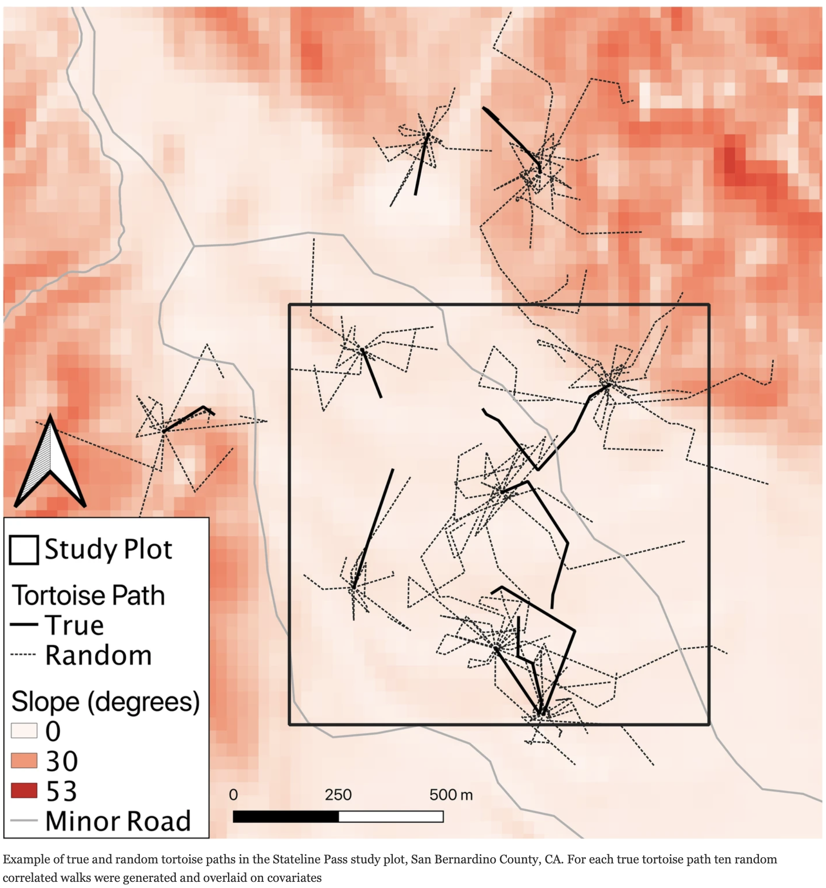
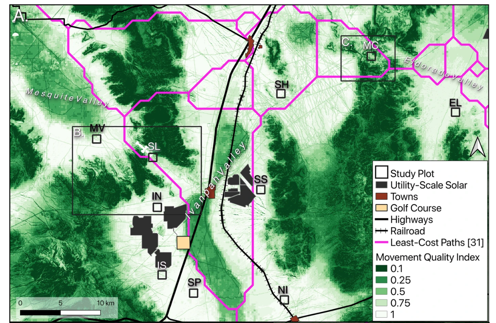

```{r setup, include=FALSE}
knitr::opts_chunk$set(echo = TRUE)
x <- c("adehabitatHR", "ctmm",
       "gplots", "ggmap", 
       "move", "moveVis",
       "plyr",
       "raster", "rgdal",
       "scales", "sf", "sp")
lapply(x, require, character.only = T)
rm(x)
```

# Recap

Previously we:

- access tracking data on-line;
- home range;
- exercise on estimating home range.

To navigate back to the course home page click [here!](https://giulianocolosimo.github.io/anmtbc_2022/)

# Overview

In this fourth lesson we will:

- review exercise;
- paper discussion;
- home range with AKDE;
- paper assignment.

# Review excercise

## The environmental-data automated track annotation (Env-DATA) system: linking animal tracks with environmental data [@Dodge2013]

Your exercise was to reconstruct the same map the authors produced in their paper. The **Galapagos Albatrosses** data set is easily accessible using the "getMovebankData()" function you have already used.

```{r exer_1, include=FALSE}
login <- movebankLogin(username = "Giuliano", password = "2@imlL85_G")
```

```{r exer_2, echo=TRUE, fig.align = 'center', fig.cap = '**Figure 1:** Basic plot of the Galàpagos dataset downloaded from movebank.'}
#library(move)
#login <- movebankLogin(username = "Giuliano", password = "XXXXXXXXXX")
gala_alba <- getMovebankData(study = "Galapagos Albatrosses", login = login)
plot(gala_alba)
```

The supplementary on-line material included the function to produce Figure 5a. The variables used in the functions are defined as follows, and the function is shown right below.

- *move*: represents a set of animal locations as a SpatialPointDataFrame (“move” contains coordinates—longitude and latitude—timestamps, and other attributes such as annotated variables obtained from Env-DATA)
- *variable*: environmental variable name existing as a column in move. (e.g. oceanNPP)
- *lonlim*: a vector of min and max longitudes (e.g. lonlim = c(-95,-75)) 
- *latlim*: a vector of min and max latitudes (e.g. latlim = c(-14,10) )
- *envdata*: is a data.frame containing three columns in long format: x (e.g. longitude) , y (e.g. latitude), and z (e.g. value) 

When copying and pasting the function from the supplementary materials you will have noticed that the function was not assigned any name. I assigned the arbitrary name of "dodge_function()" to it. Also, the function calls on some packages that are needed to perform the graph. The main issue is that a package called **field** does not exist on [CRAN](https://cran.r-project.org/web/packages/available_packages_by_name.html#available-packages-A). There is a package called **fields**, which is a package that is used to do spatial data analyses. I beleieve there was an error when writing the document and the "s" was forgotten!

```{r dodge_function, eval = T, include = T}
dodge_function <- function(move, variable, latlim, lonlim){
  require(maptools)
  require(sp)
  require(fields)
  vCol <- which(colnames(move@data) == variable)
  temp <- levels(as.factor(as.character(unique(move@data[ , vCol]))))  
  temp <- as.character(temp[!is.na(temp)])
  zr <- range(as.numeric(temp))
  # generate a color scale
  colorpalette <- colorRampPalette(c("blue3","cyan3","aquamarine3","yellow","orange","red")) 
  mycol <- colorpalette(length(temp))
  # plot underlying map
  data(wrld_simpl)
  plot(wrld_simpl, ylim = latlim, xlim = lonlim, col = "lightgray", border = "gray", axes = F)
  # plot the track as a gray ployline
  points(coordinates(move), type = "l", col = "gray") 
  # plot track points colored using a color scale based on the variable values (high values in Red, low values in Blue)
  for(i in 1:length(temp)){
    plot (move[move@data[ , vCol] == temp[i], ],
          pch = 20, add = TRUE, col = mycol[i], border = "gray", axes = F)
  }
  # plot color scale legend 
  image.plot(legend.only = TRUE, zlim = zr, col = mycol,  horizontal = F, legend.width = 1, legend.mar = NULL, legend.shrink = 0.8, cex.axis = 0.7)
}
```

### Test the data and the function
```{r prep_data, echo=TRUE}
gala_alba <- read.csv("../../data/gala_alba/gala_alba.csv", header = T)
head(gala_alba)
nrow(gala_alba)
names(gala_alba)
names(gala_alba)[26] <- "npp_8d_0.083dg"

# remove NA coordinates
gala_alba <- gala_alba[!is.na(gala_alba$location.long), ]
nrow(gala_alba)

# remove NA npp values
gala_alba <- gala_alba[!is.na(gala_alba$npp_8d_0.083dg), ]
nrow(gala_alba)

# create a SpatialPointsDataFrame from the data frame data
gala_alba_sp <- SpatialPointsDataFrame(gala_alba[,c("location.long", "location.lat")],
                                       data = gala_alba,
                                       proj4string = CRS("+proj=longlat +ellps=WGS84 +datum=WGS84 +no_defs"))

```

```{r dodge_function_test, eval = T, message = FALSE, warning = FALSE, include = T, fig.align = 'center', fig.cap = "**Figure 2:** Figure 5A. The paper does not provide all the details needed to reproduce exactly the same image."}
# Now we should be ready to run the function
dodge_function(gala_alba_sp, "npp_8d_0.083dg", c(-14, 2), c(-95, -75))
```


# Paper discussion

## Using movement to inform conservation corridor design for Mojave desert tortoise [@Hromada2020]

```{r species_pic, message = FALSE, warning = FALSE, fig.align = 'center', , fig.cap = "**Figure 3:** The critically endangered species under investigation: *Gopherus agassizii*. [Image source](https://en.wikipedia.org/wiki/Desert_tortoise)", out.width='70%'}
knitr::include_graphics('../../figures/4_gopherus_agassizii.png')
```

- "...conservation plans incorporating connectivity goals call for the establishment of corridors—regions of the landscape that serve to maintain or facilitate functional connections between populations of organisms through areas of inhospitable landscape."
- "...corridors intended to preserve historic genetic connectivity..."
- corridor-passers and corridor-dwellers
- "The majority of Mojave Desert tortoise habitat falls in bajadas (coalescing alluvial fans)"
- "Maintaining historic range wide connectivity has been identified as a key factor for the recovery of the species."
- "Much of desert tortoise habitat has been intersected by transportation infrastructure, ranging from single track recreation trails to superhighways and railroads."
- "**To characterize natural and mitigation corridors for tortoise population connectivity, we describe a model of tortoise movement generated from fine-scale GPS telemetry data that indicates path selection in response to both natural features and anthropogenic disturbances.**"

```{r paper_figure, message = FALSE, warning = FALSE, fig.align = 'center', fig.cap = "**Figure 4:** Map of the study area in the Ivanpah Valley [@Hromada2020]", out.width = '70%'}
knitr::include_graphics('../../figures/4_hromada_fig_1.png')
```

```{r paper_figure2, message = FALSE, warning = FALSE, fig.align = 'center', fig.cap = "**Figure 5:** Path Selection Function [@Hromada2020]", out.width = '70%'}

```

```{r paper_figure3, message = FALSE, warning = FALSE, fig.align = 'center', fig.cap = "**Figure 6:** Tortoise movement quality map [@Hromada2020]", out.width = '70%'}

```


# Home range estimation with auto-correlated kernel density method

Last time we saw how to estimate a home range using the Minimum Convex Polygon approach. This time we will calculate home ranges using real data and a more complex procedure from the *ctmm* package [@Calabrese2016].

This method uses a Continuous Time Stochastic Process model (CTSP), which is a model that is able to account for autocorrelation in our data. Data autocorrelation is that phenomenon according to which data sampled close to each other (both in time and space) may not contain independent information from each other. In other words, spatial data points may often not be independent from each other if sampled at a very high temporal resolution. 

CTSPs use statistical methods, such as variograms, to account for autocorrelation in data. We will follow the [vignette](https://cran.r-project.org/web/packages/ctmm/vignettes/akde.html) from the package *ctmm* and try to reproduce and understand the process to reconstruct home ranges using this approach. Since we already have downloaded the Albatross data set from Movebank we will use that one.

```{r kernel_1, echo=TRUE, message=FALSE, warning=FALSE}
gala_alba_tl <- as.telemetry(gala_alba)
summary(gala_alba_tl)
```

We can select one of the Albatrosses that has been followed for a long time.

```{r kernel_2, echo=TRUE, message=FALSE, warning=FALSE}
A1163_1163 <- gala_alba_tl$`1163-1163`
```

We can now work on the variogram and see how autocorrelation is affecting our data. Below we represent the square distance traveled (vertical axis) per unit time or time-lag (horizontal axis). We can plot a short time-lag and a long time-lag.

```{r kernel_3, echo=TRUE, message=FALSE, warning=FALSE, fig.align = 'center', fig.cap = "**Figure 7:** Short time-lag representation of individual"}
SVF <- variogram(A1163_1163)
level <- c(0.5, 0.95) # 50% and 95% CIs
xlim <- c(0, 12 %#% "hour") # 0-12 hour window
plot(SVF, xlim = xlim, level = level)
title("Short time-lag")
```

```{r kernel_4, echo=TRUE, message=FALSE, warning=FALSE, fig.align = 'center', fig.cap = "**Figure 6:** Long time-lag representation of individual"}
plot(SVF, fraction = 0.65, level = level)
title("Long time-lag")
```

In the long time-lag we see that the variogram almost flattens (asymptotes) at approximately 7-10 days. This is, roughly, how coarse you need to make the timeseries so that methods assuming independence (no autocorrelation) can be valid. This includes, conventional kernel density estimation (KDE), minimum convex polygon (MCP), conventional species distribution modeling (SDM), and a host of other analyses.

We now “fit” time models to the variogram. We can manually guesstimate some continuous-time models for the aforementioned behavior with the commands.

```{r kernel_5, echo=TRUE, message=FALSE, warning=FALSE, fig.align = 'center', fig.cap = "**Figure 8:** Fitting an Independent and Identical time model"}
m.iid <- ctmm(sigma = 125000 %#% "km^2")
m.ou <- ctmm(sigma = 125000 %#% "km^2", tau = 6 %#% "day")
plot(SVF, CTMM = m.iid, fraction = 0.65, level = level, col.CTMM = "red")
title("Independent and identically distributed data")
```

```{r kernel_6, echo=TRUE, message=FALSE, warning=FALSE, fig.align = 'center', fig.cap = "**Figure 9:** Fitting an Ornstein-Uhlenbeck time model"}
plot(SVF, CTMM = m.ou, fraction = 0.65, level = level, col.CTMM = "purple")
title("Ornstein-Uhlenbeck movement")
```

```{r kernel_7, echo=TRUE, message=FALSE, warning=FALSE, fig.align = 'center', fig.cap = "**Figure 10:** Fitting an Ornstein-Uhlenbeck time model with detail on the short time-lag"}
m.ouf <- ctmm(sigma = 125000 %#% "km^2", tau = c(7 %#% "day", 12 %#% "hour"))
plot(SVF, CTMM = m.ou, level = level, col.CTMM = "purple", xlim = xlim)
title("Ornstein-Uhlenbeck movement")
```

```{r kernel_8, echo=TRUE, message=FALSE, warning=FALSE, fig.align = 'center', fig.cap = "**Figure 11:** Fitting an Ornstein-Uhlenbeck-F time model with detail on the short time-lag"}
plot(SVF, CTMM = m.ouf, level = level, col.CTMM = "blue", xlim = xlim)
title("Ornstein-Uhlenbeck-F movement")
```

```{r kernel_9, echo=TRUE, message=FALSE, warning=FALSE, fig.align = 'center', fig.cap = "**Figure 12:** Fitting an Ornstein-Uhlenbeck time model with detail on the long time-lag"}
plot(SVF, CTMM = m.ou, fraction = 0.65, level = level, col.CTMM = "purple")
title("Ornstein-Uhlenbeck movement")
```

```{r kernel_10, echo=TRUE, message=FALSE, warning=FALSE, fig.align = 'center', fig.cap = "**Figure 13:** Fitting an Ornstein-Uhlenbeck time model with detail on the long time-lag"}
plot(SVF, CTMM = m.ouf, fraction = 0.65, level = level, col.CTMM = "blue")
title("Ornstein-Uhlenbeck-F movement")
```

```{r kernel_11, echo=TRUE}
M.IID <- ctmm.fit(A1163_1163, m.iid)
M.OU <- ctmm.fit(A1163_1163, m.ou)
M.OUF <- ctmm.fit(A1163_1163, m.ouf)
FITS <- list (IID = M.IID, OU = M.OU, OUF = M.OUF)
summary(FITS)
```

```{r kernel_12, echo=TRUE}
UD0 <- akde(A1163_1163, M.IID)
UD2 <- akde(A1163_1163, M.OUF)
UD2w <- akde(A1163_1163, M.OUF, weights = TRUE)
# calculate one extent for all UDs
EXT <- extent(list(UD0, UD2, UD2w), level = 0.95)
```

```{r kernel_13, echo=TRUE, fig.align = 'center', fig.cap = "**Figure 14:** AKDE home range with IID model"}
plot(A1163_1163, UD = UD0, xlim = EXT$x, ylim = EXT$y)
title(expression("IID KDE"["C"]))
```

```{r kernel_14, echo=TRUE, fig.align = 'center', fig.cap = "**Figure 15:** AKDE home range with OUF model"}
plot(A1163_1163, UD = UD2, xlim = EXT$x, ylim = EXT$y)
title(expression("OUF AKDE"["C"]))
```

```{r kernel_15, echo=TRUE, fig.align = 'center', fig.cap = "**Figure 16:** AKDE home range with OUF and weights model"}
plot(A1163_1163, UD = UD2w, xlim = EXT$x, ylim = EXT$y)
title(expression("weighted OUF AKDE"["C"]))
```


# Readings

One paper to read for next class:

- Genetic tagging in the Anthropocene: scaling ecology from alleles to ecosystems [@Lamb2019]


# Reference