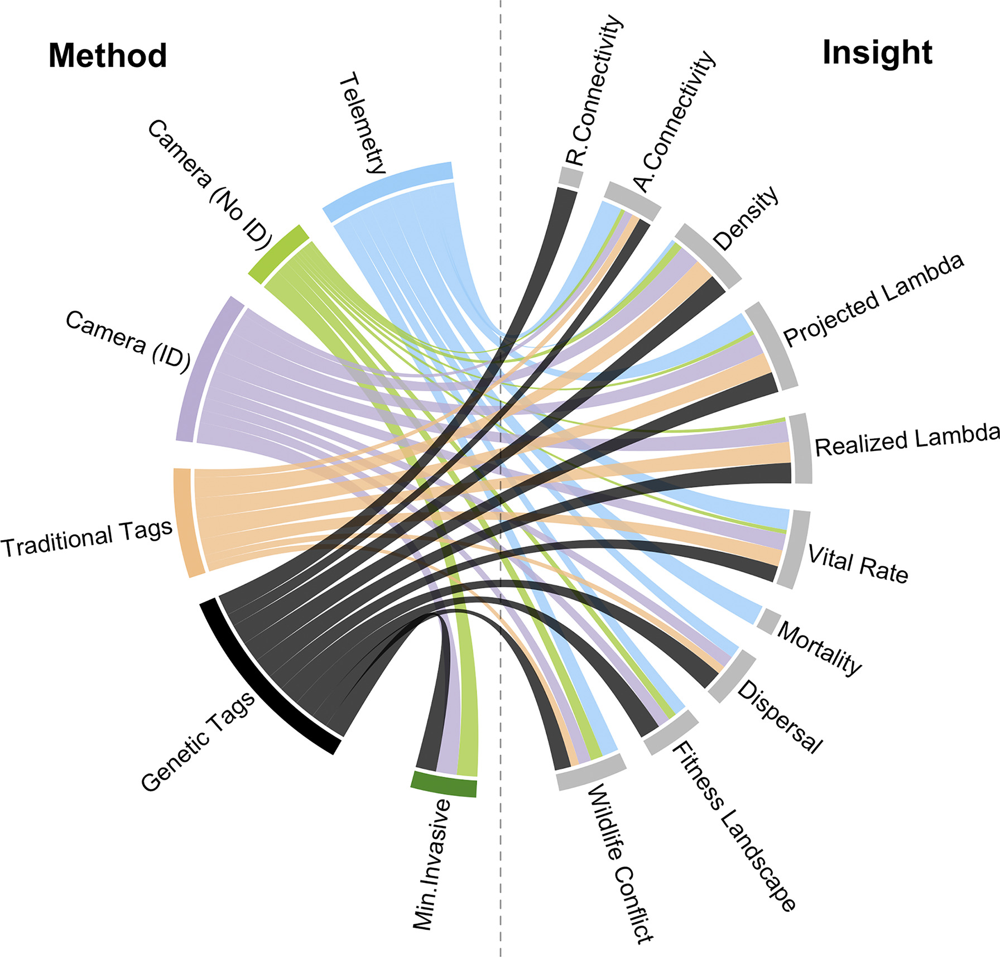
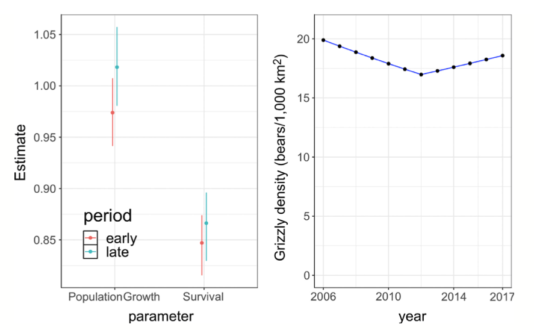
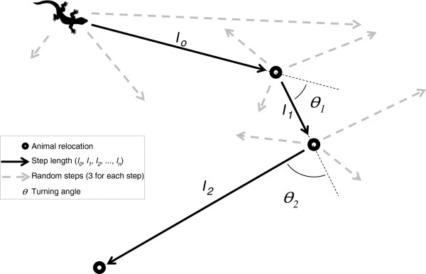

```{r setup, include=FALSE}
knitr::opts_chunk$set(echo = TRUE)
x <- c("adehabitatHR", "amt",
       "gplots", "ggmap", 
       "move", "moveVis",
       "dplyr",
       "raster", "rgdal",
       "scales", "sf", "sp")
lapply(x, require, character.only = T)
rm(x)
```

# Recap

Previously we:

- reviewed the exercise;
- home range with aKDE;

To navigate back to the course home page click [here!](https://giulianocolosimo.github.io/anmtbc_2022/)

# Overview

In this fifth lesson we will:

- corridor dweller VS corridor passers;
- paper discussion;
- Resource Selection Functions (RSFs);
- paper assignment.

# Corridor dweller VS corridor passers 

>- A conservation corridor is a continuous swath of relatively natural land between natural landscape blocks (e.g., protected areas) [@Beier2018].
>- So, when we think about corridors, we should think about the patches of natural habitat they connect rather than the species that will use them! 
>- With this in mind, it is easier to understand that a species that is considered a  **corridor-dweller** needs large corridors as it may spend a significant amount of time there.
>- Being a **corridor-dweller** is an attribute of the species and does not concern the corridor itself.

# Paper discussion

## Genetic tagging in the Anthropocene: scaling ecology from alleles to ecosystems [@Lamb2019]

<span class="underline">[Anthropocene](https://en.wikipedia.org/wiki/Anthropocene)</span>: is a proposed geological epoch dating from the commencement of significant human impact on Earth's geology and ecosystems, including, but not limited to, anthropogenic climate change.

>The extent to which climate change and habitat loss will impact the density and distribution of wild populations in the future is one of the greatest sources of scien- tific uncertainty in modern ecology and conservation.

- Genetic tags are unique sequences of DNA (or typed loci) used to identify individuals and their species, sex, and lineage.
- Two main challenges exist in genetic tagging free-ranging animals: **1)** low quality and quantity of DNA available from minimally invasive sampling (MIS) approaches; **2)** genotyping enough molecular markers to provide sufficient resolution for pedigree reconstruction.
- Why and how does population density change across space?
- Why and how does population size change through time?
- How and at what rate do organisms move between populations and across space?
- How can negative interactions between people and wildlife be mitigated?

```{r fig_1, echo=FALSE, fig.align='center', fig.cap='**Figure 1:** Genetic Tags can bridge the gap between different parameters of interest for conservation [@Lamb2019].', out.width='58%'}

```

```{r fig_2, echo=FALSE, fig.align='center', fig.cap='**Figure 2:** Use of genetic tags to estimate demographic parameters [@Lamb2019].', out.width='58%'}

```

# Resource Selection Functions (RSFs)

Animal populations require sufficient amount of resources to sustain themselves. Resources can include, but are not limited to, water, food, substrate, partners, habitat, etc. etc. etc... Conservation biologists are interested in identifying these resources and document how their availability varies in space and time. 

>Determining which resources are selected more often than others is of particular interest because it provides fundamental information about the nature of animals and how they meet their requirements for survival [@Manly2007].

Central to the paradigm of resources selection is that the selection process happens because there is something to select from. The availability of different resources is not uniform in time and space. Therefore, resource selection may change as availability of resources change. With this in mind we can understand how it is important to analyze what resources are used (or NOT used) in comparison to what is available. When resources are used disproportionately to their availability, use is said to be selective [@Manly2007].

In general, RSFs examine covariates (i.e., variables such as temperature, food, etc. etc. etc...) associated with locations where the animal was observed with covariates associated with random locations within the availability domain. The availability domain can be defined as a spatial area available to an individual [@Signer2019].

As you can imagine, one of the most cogent problem is to define a suitable availability domain for an individual!

## Combining RSFs with movement data

Individual movements are often related to the position and availability of the aforementioned resources. Movement may be modeled as the straight-line steps between consecutive points, or the entire pathway of an individual [@Zeller2015].

```{r fig_3, echo=FALSE, fig.align='center', fig.cap='**Figure 3:** Schematic representation of an animal movement. This image is borrowed from @Thurfjell2014', out.width='58%'}

```

We can combine the principles of resources selection functions with animal movements to obtain two classes of models:

- Step Selection Functions (SSF) 
- Path Selection Functions (PSF)

### Exercise

I am not going to reinvent the wheel!! We will be following together a tutorial on-line explaining how to use *amt*, and R package to process and analyze animal movements. This package offers the possibility to perform Resource Selection Functions as well as Step Selection Functions. Connect to:

<center>https://cran.r-project.org/web/packages/amt/index.html</center>

# Reading

Environmental and anthropogenic influences on movement and foraging in a critically endangered lemur species, *Propithecus tattersalli*: implications for habitat conservation planning [@Semel2022]

# Reference
